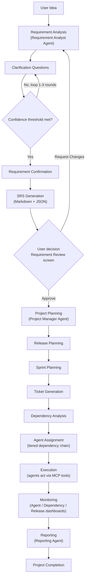
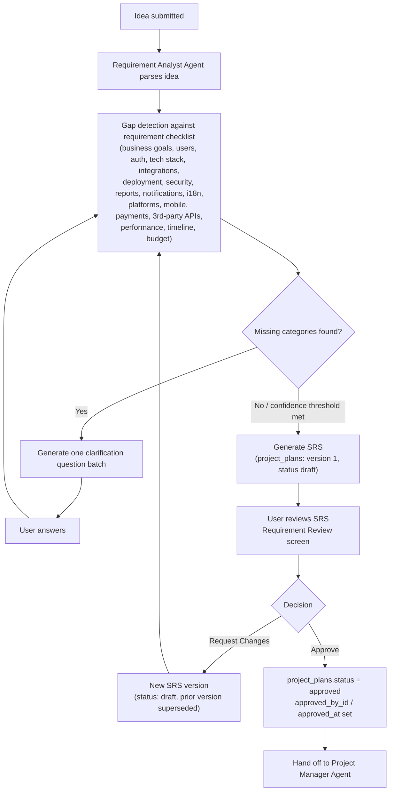
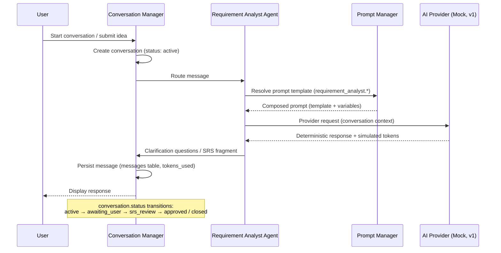
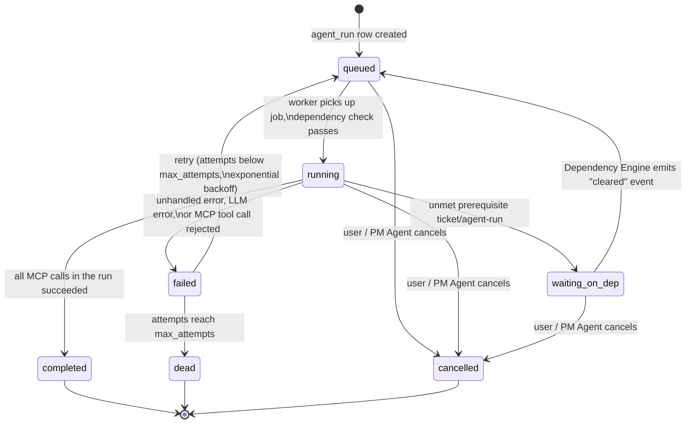
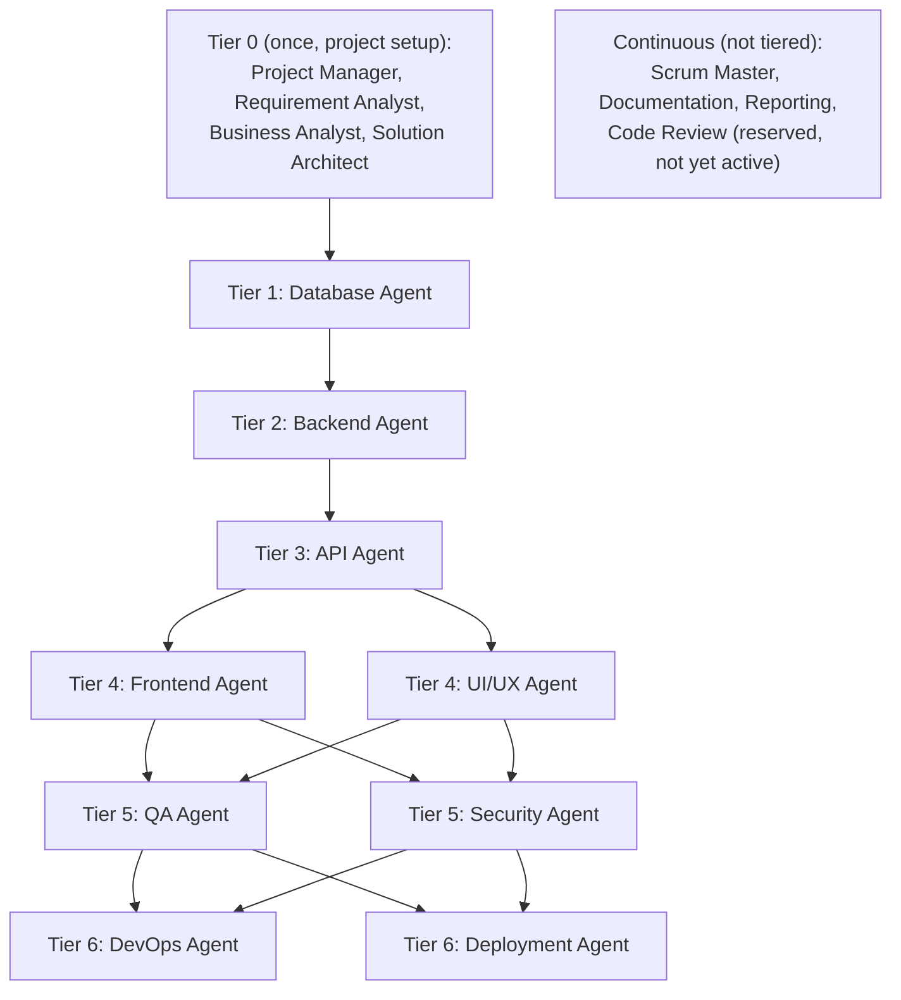
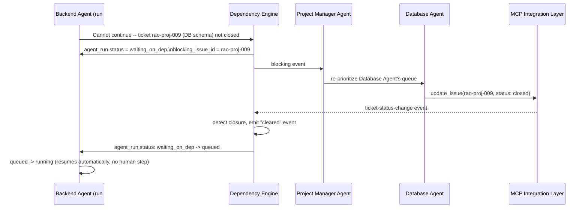
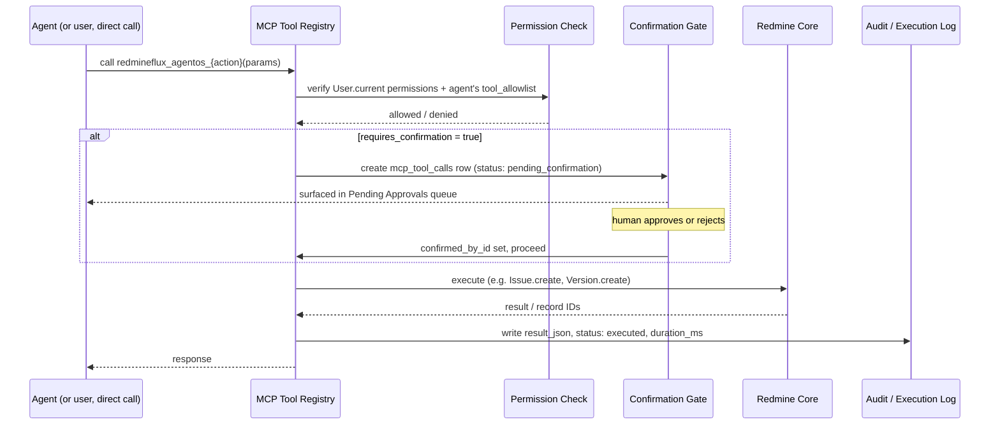
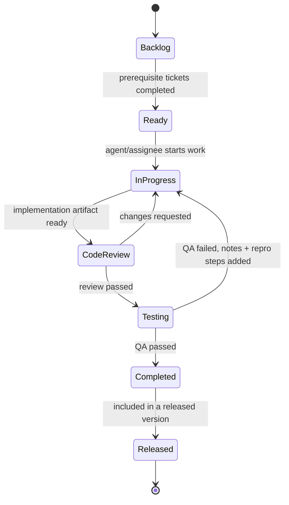
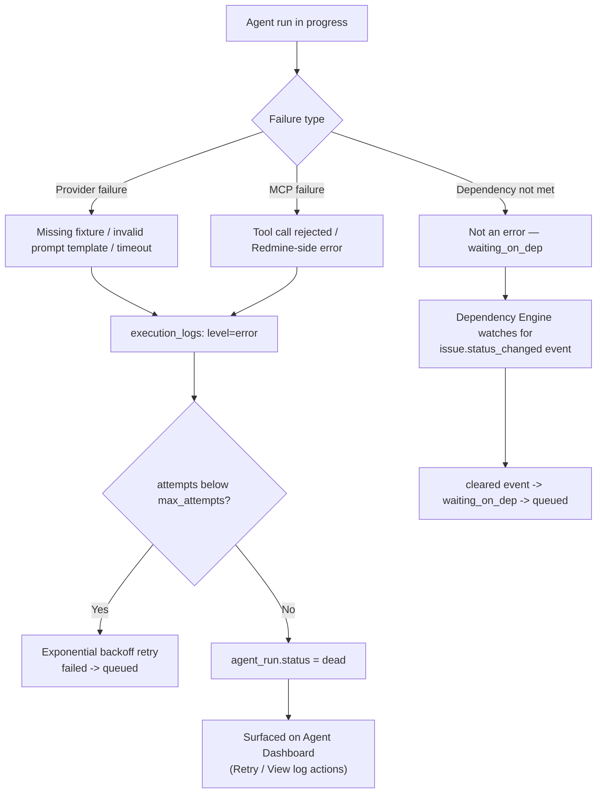
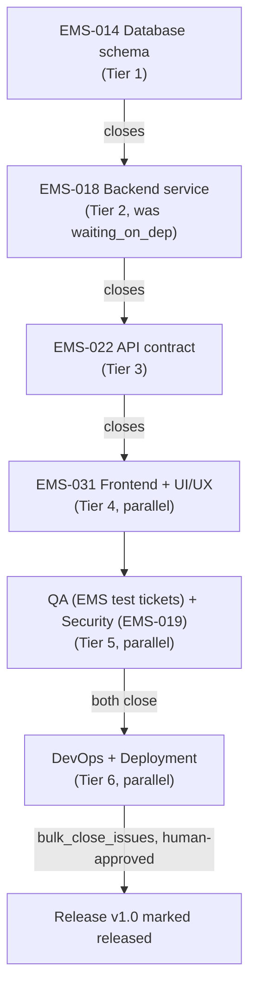

# WORKFLOW.md — RedmineFlux AgentOS End-to-End Workflow Specification

**Status**: Specification only. No Ruby, Rails, migrations, controllers, models, views, JavaScript, CSS, or test code exists in or is implied by this document.
**Scope**: Defines how AgentOS operates end-to-end — from a user's natural-language idea to a continuously-managed Redmine project — at a level of detail sufficient for implementation without re-deriving the architecture.
**Version boundary**: Version 1 uses a **Mock AI Provider** (deterministic, fixture-based — see [ROADMAP.md](ROADMAP.md) Phase 3). Every workflow below is written so that swapping in a real LLM provider later changes nothing except the Provider implementation (§27).
**Companion docs**: [VISION.md](VISION.md) · [Readme.md](Readme.md) · [ROADMAP.md](ROADMAP.md) · [docs/PHASE1-SPECIFICATION.md](docs/PHASE1-SPECIFICATION.md) · [docs/AGENTS.md](docs/AGENTS.md) · [docs/MCP-TOOLS.md](docs/MCP-TOOLS.md) · [docs/DATABASE-SCHEMA.md](docs/DATABASE-SCHEMA.md) · [docs/UI-WIREFRAMES.md](docs/UI-WIREFRAMES.md)

**How to read this document**: Where a workflow is already fully defined by an approved spec (`rao-001`), this document cites it and adds the missing connective tissue (sequencing, diagrams, cross-module handoffs). Where a workflow reaches ahead of what's been formally specified yet (Mock AI Provider internals, Event Bus, pause/resume), it is marked **(forward-looking — formalized in [ROADMAP.md](ROADMAP.md) Phase N)** so nothing here is mistaken for an already-gated decision.

---

## 1. Purpose

AgentOS turns Redmine from a project-tracking system a human must operate into an AI-powered software delivery platform that operates itself for the mechanical parts of delivery. A user states a product idea in natural language; a coordinated team of specialized AI agents — modeled on the roles of a real software company (§9 in [Readme.md](Readme.md), full roster in [docs/AGENTS.md](docs/AGENTS.md)) — interviews the user, produces a reviewed Software Requirement Specification (SRS), and then builds and maintains the entire Redmine project structure (project, releases, sprints, epics, tickets, dependencies, wiki, time entries, reports) by calling Redmine's real APIs through governed, audited MCP tools.

The system does not replace human judgment. It replaces the manual, repetitive operational work of *running* Redmine: creating the structure, keeping tickets moving, keeping status current, and keeping documentation in sync — so humans spend their time on decisions (approving the SRS, approving irreversible actions, reviewing outcomes) rather than data entry.

---

## 2. Design Principles

| Principle | What it means in this system |
|---|---|
| **Architecture First** | Every module in this workflow was specified (Phase 1, `rao-001`) before any code exists. No implementation precedes an approved spec. |
| **Provider Agnostic** | Every LLM interaction — Mock or real — passes through one Provider Interface (§7). No agent, conversation, or workflow logic ever branches on which provider is active. |
| **MCP First** | Agents never touch Redmine's ActiveRecord models directly. Every Redmine state change is a governed MCP tool call (§10) — uniformly logged, permission-checked, and confirmable regardless of which agent or UI surface triggered it. |
| **Human-in-the-Loop** | Agents assist, they don't silently replace approval authority. The SRS and every irreversible/high-blast-radius action require explicit human confirmation (§22). |
| **Multi-Agent Collaboration** | Work is decomposed across 17 specialized agent roles that communicate through the Workflow Engine's inter-agent channel and a shared dependency graph, not as one monolithic "AI" (§9). |
| **Deterministic Version 1** | The Mock AI Provider produces fixture-based, reproducible output. This lets the entire workflow — conversation, planning, ticketing, dependency resolution, dashboards — be built and tested before any real LLM is wired in. |
| **Event Driven** | State changes (ticket closed, dependency cleared, agent run failed) propagate as events, not polling — agents resume automatically when their blocking condition clears (§9, §15). |
| **Modular** | Each responsibility (Requirement Analysis, Planning, Dependency resolution, Ticket generation, MCP execution, Reporting) is an isolated module with one owner, per the module table in [docs/PHASE1-SPECIFICATION.md](docs/PHASE1-SPECIFICATION.md) §2.2. |
| **Scalable** | Multiple agents run concurrently, across multiple projects, as background jobs — never inline in a web request (NFR in `rao-001` §1.3). |
| **Secure** | Least-privilege tool allow-lists per agent, `User.current` always scoped explicitly, no raw SQL, no secrets in logs/JSON — see §26. |
| **Observable** | Every LLM call, every MCP call, every state transition is logged and correlated by `agent_run_id` (§20). |
| **Extensible** | New agent roles, new MCP tools, and new providers plug into the same contracts without changing the workflows described here. |

---

## 3. High-Level Workflow

```
User Idea
   ↓
Requirement Analysis
   ↓
Clarification Questions  (loops 1-3 rounds until confidence threshold met)
   ↓
Requirement Confirmation  (clarification loop closes — not yet the SRS approval gate)
   ↓
SRS Generation
   ↓
[ Human gate: SRS Approval — see §22 ]
   ↓
Project Planning
   ↓
Release Planning
   ↓
Sprint Planning
   ↓
Ticket Generation
   ↓
Dependency Analysis
   ↓
Agent Assignment
   ↓
Execution
   ↓
Monitoring
   ↓
Reporting
   ↓
Project Completion
```



This is the same lifecycle described in [VISION.md](VISION.md) "Core Objective" and step-by-step in [docs/PHASE1-SPECIFICATION.md](docs/PHASE1-SPECIFICATION.md) §1.1; the sections below expand each stage.

---

## 4. User Journey

### 4.1 Happy path

1. **Open AgentOS** — project-level `AgentOS` module menu, or the global **+ New AI Project** entry point ([docs/PHASE1-SPECIFICATION.md](docs/PHASE1-SPECIFICATION.md) §4).
2. **Start AI Project** — launches the AI Chat / New AI Project Wizard ([docs/UI-WIREFRAMES.md](docs/UI-WIREFRAMES.md) §1).
3. **Enter project idea** — one free-text paragraph.
4. **Review clarification questions** — one batched question set at a time, not a 20-question wall; a progress bar shows requirement confidence.
5. **Answer questions** — may repeat 1-3 rounds until confidence threshold is met.
6. **Review SRS** — Requirement Review screen ([docs/UI-WIREFRAMES.md](docs/UI-WIREFRAMES.md) §2) renders the generated SRS sections (Overview, Users & Roles, Modules, NFRs, Integrations, Assumptions & Risks).
7. **Approve requirements** — clicks **Approve & Create Plan**. This is the FR-03 gate: no Redmine artifact exists before this click.
8. **System builds the plan** — Project Manager Agent and downstream agents create Project → Releases → Sprints → Epics → Tickets → Dependencies via MCP, in the background.
9. **Monitor agents** — Agent Dashboard, Dependency Dashboard, Release Planner ([docs/UI-WIREFRAMES.md](docs/UI-WIREFRAMES.md) §3-5) show live status.
10. **Review generated artifacts** — tickets, wiki pages, architecture docs appear in native Redmine views as they're created.
11. **Approve pending actions** — any irreversible MCP action (bulk close, delete) surfaces in the Pending Approvals queue; user approves or rejects.
12. **Project completion** — Reporting Agent produces a completion/release-readiness report; project reaches its final release.

### 4.2 Alternative flows

| Trigger | Flow |
|---|---|
| User clicks **Request Changes** on the SRS | Returns to the AI Chat conversation; Requirement Analyst Agent re-engages, may ask follow-up questions, generates a new SRS version (`project_plans.version` increments, prior version `status: superseded`) |
| User asks an out-of-scope or ambiguous question mid-clarification | Requirement Analyst Agent flags it in the SRS "Assumptions & Open Risks" section rather than blocking the loop indefinitely |
| A `requires_confirmation` MCP action is requested | Execution pauses for that specific action only (other agents keep working); action sits in Pending Approvals until a human with the relevant permission approves or rejects it (§22) |
| An agent run fails past its retry budget | Agent Dashboard shows the run as `dead` with **Retry** / **View log** actions; project execution continues for unblocked agents (§21) |
| User has no `create_ai_project` permission | The **+ New AI Project** entry point and AI Chat menu item are not shown at all (permission-gated per [docs/PHASE1-SPECIFICATION.md](docs/PHASE1-SPECIFICATION.md) §5) |

---

## 5. Requirement Collection Workflow



**Decision points**:
- *Confidence threshold* — an internal gap-detection score; below threshold, another clarification round is generated. This is a soft, non-blocking loop bounded at roughly 1-3 rounds to avoid a "20-question wall" (per `rao-001` §1.1).
- *SRS approval* — the hard gate. Per FR-03, no Project/Version/Issue is created in Redmine until `project_plans.status = approved`.
- *Request Changes* — always produces a new SRS version rather than mutating the approved/reviewed one in place, preserving history for audit.

---

## 6. Conversation Workflow



Conversation and message persistence match `redmineflux_agentos_conversations` and `redmineflux_agentos_messages` in [docs/DATABASE-SCHEMA.md](docs/DATABASE-SCHEMA.md): a conversation is tied to a project only once one exists (nullable until then), each message records its role (`user/agent/system`), owning agent when applicable, and simulated token count.

---

## 7. Provider Workflow

**(forward-looking — the authoritative contract is [ROADMAP.md](ROADMAP.md) Phase 3, not yet its own gate-approved spec; this section describes the shape every downstream workflow already assumes.)**

Version 1 ships with exactly one provider: the **Mock AI Provider**. It is deterministic and fixture-based — it never calls an external LLM API.

1. **Provider selection** — Configuration resolves the active provider (global default, overridable per project); in v1 this always resolves to `mock`.
2. **Request preparation** — the calling agent's composed prompt (from the Prompt Workflow, §17) plus conversation/agent context is packaged into the standard Provider request model.
3. **Fixture selection** — the Mock Provider resolves a deterministic fixture keyed by agent role + prompt category + scenario, not by hashing free-text input (see §18).
4. **Deterministic response generation** — the fixture is rendered against the request's variables and returned in the standard Provider response model (same shape a real provider would return).
5. **Response formatting** — normalized into the shape the Conversation/Agent Execution workflows expect, so callers never know or care which provider answered.
6. **Logging** — request and response are written to `execution_logs` at `debug`/`info` level, correlated by `agent_run_id`.
7. **Simulated token tracking** — the fixture carries (or the Mock Provider computes) a plausible `prompt_tokens` / `completion_tokens` pair, written to `token_usages` (§19).
8. **Simulated cost tracking** — token counts are converted to a simulated cost via the same rate-card mechanism a real provider would use (`cost_trackings` rollup), clearly labeled as simulated in every dashboard (§19).

**Future providers** (§27) replace only step 3-4 (fixture lookup → real API call) and step 7-8 (simulated → actual token/cost figures returned by the provider). Steps 1, 2, 5, 6 are provider-agnostic and do not change.

---

## 8. Agent Lifecycle Workflow

The authoritative agent-run state machine is defined in [docs/PHASE1-SPECIFICATION.md](docs/PHASE1-SPECIFICATION.md) §6 and backed by `redmineflux_agentos_agent_runs.status`. It is reproduced here as the canonical reference for this document:



**Mapping conceptual lifecycle language to the canonical states**:

| Conceptual state | Canonical state / transition |
|---|---|
| Created | `agent_run` row inserted — immediately enters `queued` in v1, there is no separate persisted "created" state |
| Ready | `queued`, with dependency check already passing |
| Waiting | `waiting_on_dep` |
| Running | `running` |
| Blocked | subsumed by `waiting_on_dep` — there is no separate "blocked" state; blocking always records a `blocking_issue_id` |
| Retrying | the `failed → queued` transition, bounded by `attempts` / `max_attempts` |
| Completed | `completed` |
| Failed | `failed` (transient, may still retry) vs. `dead` (terminal, attempts exhausted, needs human action) |
| Cancelled | `cancelled` |
| **Paused** | **not yet a first-class state.** Pause/Resume is listed as a [ROADMAP.md](ROADMAP.md) Phase 8 (Workflow Engine & Orchestration) deliverable. Until Phase 8 is specified, "pausing" an agent is done by cancelling its run; there is no resume-from-pause path today. Flagged here so Phase 8 reconciles it against this table rather than inventing a conflicting state. |

---

## 9. Multi-Agent Collaboration Workflow

Agents are organized into dependency **tiers**, seeded by the Solution Architect Agent and enforced by the Dependency Engine (full roster and tool grants in [docs/AGENTS.md](docs/AGENTS.md)):



This is the *default* chain; the Dependency Engine ultimately operates on explicit ticket-level edges in `redmineflux_agentos_dependencies`, so a specific project's SRS can imply a different order.

**Blocking / resuming example** (verbatim mechanics from `rao-001` §6.3):



No human step is required to resume — only to approve irreversible actions (§22) or to intervene on a `dead` run (§21).

---

## 10. MCP Workflow

Every Redmine-affecting action is a tool named `redmineflux_agentos_{action}` (full catalog in [docs/MCP-TOOLS.md](docs/MCP-TOOLS.md)). The request/response lifecycle is uniform regardless of caller:



**Tool categories** (exact names per [docs/MCP-TOOLS.md](docs/MCP-TOOLS.md)):

| Category | Tools | Confirmation required |
|---|---|---|
| Project & planning | `create_project`, `update_project`, `create_version`, `read_project` | No |
| Issues | `create_issue`, `update_issue`, `assign_issue`, `add_comment`, `create_issue_relation`, `search_issues`, `read_ticket`, `read_comments` | No |
| Issues (destructive) | `bulk_close_issues`, `delete_issue` | **Yes** |
| Wiki | `create_wiki_page`, `update_wiki`, `search_wiki` | No |
| Files | `upload_file` | No |
| Time & workload | `create_time_entry`, `update_workload` | No |
| Time & workload (destructive) | `update_timesheet` (bulk) | **Yes** |
| Reporting | `generate_report` | n/a |

**Guarantees**: every call is logged before execution and updated after, so a crashed worker never leaves an untraceable action; write tools are idempotency-checked via a caller-supplied key (e.g. `ai_task_id`) so a retried agent run never double-creates a ticket; read-only tools are not audit-logged (too high volume) but are captured at `debug` level in `execution_logs`.

---

## 11. Project Planning Workflow

Order of creation, each step gated on the previous one closing successfully:

1. **Project** — Project Manager Agent calls `create_project` once the SRS is approved.
2. **Modules** — enabled per SRS scope (`update_project`).
3. **Releases** — Release Planner derives releases/milestones from the plan; each maps to a Redmine `Version` via `create_version` (`redmineflux_agentos_releases.version_id`).
4. **Sprints** — Sprint Planner derives sprints per release. Sprints are a **plugin-owned concept** (`redmineflux_agentos_sprints`) — Redmine has no native sprint primitive (AD-1 in `rao-001`); they are not created as Redmine `Version` records.
5. **Epics / Features** — Business Analyst Agent translates SRS business goals into epics with business-value framing (`create_issue`).
6. **Stories / Tasks / Subtasks** — Ticket Generator decomposes epics into the full hierarchy (§12).
7. **Dependencies** — Dependency Engine records ticket-level edges as epics/stories/tasks are created (§13).

Each created record is mirrored in the plugin's own tables (`releases`, `sprints`, `ai_tasks`) so dashboards can read fast, denormalized state without re-querying Redmine on every request — while the Redmine object (`Version`, `Issue`) remains the source of truth for status.

---

## 12. Ticket Generation Workflow

For every unit of work, the Ticket Generator produces an `redmineflux_agentos_ai_tasks` record (denormalized planning metadata) linked 1:1 to the Redmine `Issue` created via `create_issue`:

| Field | Populated by |
|---|---|
| `task_type` (`epic/story/task/subtask`) | Ticket Generator, from Planning Engine decomposition |
| `title`, `description` | Ticket Generator, from SRS + architecture context |
| `acceptance_criteria` | Business Analyst Agent (epics) / QA Agent verification pass |
| `priority` | Planning Engine, from SRS priority signals |
| `story_points`, `estimated_hours` | Scrum Master Agent, from historical velocity where available |
| `labels` | Ticket Generator, from module/component mapping |
| `sprint_id`, `agent_id` (owner), `suggested_reviewer_id` | Sprint Planner / Agent Manager assignment |

**Review process**: the QA Agent verifies every story/task has testable acceptance criteria before it can move toward "Ready for Release" (its Tier 5 gate, §9); the Security Agent reviews the same ticket set against the Gate 2 checklist categories (§26) before release sign-off. Neither is a blocking step on ticket *creation* — both are blocking steps on release readiness (§14, §22).

---

## 13. Dependency Workflow

Dependencies are stored as explicit edges in `redmineflux_agentos_dependencies` (`ai_task_id` depends on `depends_on_ai_task_id`, `dependency_type: blocks/relates_to`), with a unique index and an application-level cycle check at insert time. The default tier chain (§9) seeds these edges; the graph is the actual source of truth the Dependency Engine schedules against.

```
Database
  ↓
Backend
  ↓
API
  ↓
Frontend
  ↓
UI Improvements
  ↓
QA
  ↓
Deployment
```

**Automatic blocking/resuming**: when a prerequisite `ai_task`'s linked issue closes, the Dependency Engine (subscribing to the `issue.status_changed` event, §15) finds every `agent_run` whose `blocking_issue_id` matches and re-queues it (`waiting_on_dep → queued`) — the same mechanism shown in §9's sequence diagram. No agent or human has to manually notice the ticket closed.

---

## 14. Workflow Engine

The Workflow Engine owns **two distinct state machines**, and this document is explicit about which is which so they are never conflated during implementation:

1. **Agent run state machine** — `queued/running/waiting_on_dep/completed/failed/dead/cancelled`, fully defined in §8.
2. **Ticket (issue) status workflow** — the Redmine tracker workflow AgentOS drives tickets through, per [Readme.md](Readme.md) §6:



These two machines interact but do not mirror each other 1:1: an `agent_run` can be `completed` (the agent finished its unit of work, e.g. "write acceptance criteria") while the underlying ticket is still `InProgress` waiting on a different agent's contribution. `ai_tasks.status` is kept as a denormalized cache of the linked issue's status specifically so dashboards can read ticket-workflow state without joining through `agent_runs` (design note in [docs/DATABASE-SCHEMA.md](docs/DATABASE-SCHEMA.md)).

**(forward-looking — [ROADMAP.md](ROADMAP.md) Phase 8)**: event publishing/consumption contracts, formal retry policy beyond the agent-run `max_attempts` counter, pause/resume logic, and timeout handling are Workflow Engine deliverables not yet detailed beyond what's captured in §8, §9, §13, and §21 of this document. Phase 8's spec should reconcile against these sections rather than re-deriving them from scratch.

---

## 15. Event Bus Workflow

**(forward-looking — [ROADMAP.md](ROADMAP.md) Phase 2 lists "Event Bus" as a Core Technical Architecture deliverable not yet fully specified; this section describes the event shape already implied by the approved Phase 1 mechanics, e.g. "Dependency Engine subscribing to ticket-status-change events" in `rao-001` §6.3.)**

Conceptually: publishers emit events on state transitions; subscribers (chiefly the Dependency Engine, Notification Center, and Dashboard read-models) react without the publisher knowing who's listening.

**Common events implied by the approved data model**:

| Event | Emitted when | Known subscribers |
|---|---|---|
| `conversation.srs_generated` | New SRS version drafted | Dashboard (Requirement Review) |
| `conversation.srs_approved` | User approves SRS | Project Manager Agent (starts planning) |
| `project.created` | `create_project` executes | Notification Center, Dashboard |
| `issue.status_changed` | Any `update_issue` status change | Dependency Engine, Dashboard, Scrum Master Agent |
| `dependency.cleared` | Dependency Engine detects a prerequisite closed | The specific blocked `agent_run` |
| `agent_run.queued` / `.running` / `.waiting_on_dep` / `.completed` / `.failed` / `.dead` / `.cancelled` | Agent run state machine transition (§8) | Dashboard, Notification Center |
| `mcp_tool_call.pending_confirmation` | A `requires_confirmation` tool call is created | Pending Approvals queue (Agent Dashboard) |
| `mcp_tool_call.executed` / `.rejected` / `.failed` | Confirmation resolved or call completes | Audit Logs, Dashboard |
| `report.generated` | Reporting System completes a report | Notification Center |

**Persistence / replay**: every event listed above already has a durable row backing it (`agent_runs`, `mcp_tool_calls`, `execution_logs`, `audit_logs`) — so even before a formal Event Bus component exists, the system can reconstruct "what happened" by replaying these tables in `created_at` order. A dedicated Event Bus (Phase 2/8) would formalize dispatch and subscription, not create new source-of-truth data.

---

## 16. Memory Workflow

Backed by `redmineflux_agentos_agent_memories` (unique per `agent_id, project_id, scope, key`):

- **Retrieval**: at the start of an agent run, the Agent Engine loads all `long_term` memory scoped to `(agent, project)` plus any `short_term` memory for the current conversation/run.
- **Update**: on run completion, new/changed memory is written back — e.g. Solution Architect Agent's architecture decisions log, Database Agent's schema decisions, Scrum Master Agent's historical velocity.
- **Shared memory**: `project_id: null` rows are cross-project (an agent's general operating knowledge, not tied to one engagement).
- **Expiration**: `short_term` entries carry `expires_at` and are not retrieved once expired; `long_term` entries persist indefinitely unless explicitly superseded.

---

## 17. Prompt Workflow

Backed by `redmineflux_agentos_prompt_templates` (`key`, optional `agent_id` for role-specific templates, `version`, `variables_json`, `is_active`):

1. **Selection** — the calling agent resolves its template by `key` (e.g. `requirement_analyst.clarify_questions`) via the Prompt Manager.
2. **Composition** — the active version's `content` is interpolated against `variables_json`-declared variables (conversation context, SRS fragments, ticket data).
3. **Validation** — declared variables must be present before send; a missing required variable is a Provider Workflow error (§21), not a silent blank.
4. **Versioning** — editing a template creates a new `version`; only one version per `key` is `is_active` at a time, so an in-flight agent run always resolves a stable template even if an admin edits the library mid-run.
5. **Approval** — template edits require `manage_prompt_templates`. A full multi-step review/approval workflow (beyond "save a new version, then activate it") is not yet specified and belongs to Phase 3's Prompt Template Library deliverable ([ROADMAP.md](ROADMAP.md)).
6. **Localization readiness** — `variables_json` and `content` are kept separate specifically so future localized template variants are additive, not a schema change.

---

## 18. Mock AI Workflow

**(forward-looking — [ROADMAP.md](ROADMAP.md) Phase 3)** Deterministic, fixture-based generation for every scenario the system needs in Version 1:

- Requirement Analysis (Functional/Non-functional Requirements, Business Rules, Clarification Questions, SRS Outline)
- Project Planning, Release Planning, Sprint Planning
- Ticket Creation (Epics, Features, Stories, Tasks, Subtasks, Acceptance Criteria, Estimates, Story Points, Labels)
- Dependency Mapping (e.g. Database → Backend → API → Frontend → QA → Deployment)
- Agent Collaboration examples (Backend Agent waits for Database Agent; Project Manager reprioritizes work; QA requests fixes; Documentation Agent updates wiki)
- Risk Analysis, Progress Reporting

**Fixture selection rule (conceptual, to be formalized in Phase 3)**: resolution is keyed by `(agent role, prompt category, scenario)` — never by hashing or matching the free-text user input — so the same category of request always returns the same shape of deterministic output regardless of exact wording. This is what makes Version 1 testable end-to-end without a live model.

---

## 19. Token & Cost Workflow

All figures in Version 1 are **simulated** — the Mock AI Provider was never billed by anyone.

- `redmineflux_agentos_token_usages` — one row per provider call: `prompt_tokens`, `completion_tokens`, `total_tokens`, tagged by `provider`/`model`, scoped to `agent_run_id` and denormalized `project_id`.
- `redmineflux_agentos_cost_trackings` — a daily rollup of `token_usages` through a rate card, aggregated by `project_id` (or org-wide when null).
- **Aggregation levels**: per agent run → per agent (sum across runs) → per conversation → per project → per day/month (org-wide).
- Every dashboard surfacing these numbers (§24) must visibly label them as simulated until a real provider (§27) is active.

---

## 20. Logging Workflow

| Log type | Table | Captures |
|---|---|---|
| Execution logs | `redmineflux_agentos_execution_logs` | Per-`agent_run` structured events at `debug/info/warn/error`, including provider request/response and read-only MCP calls |
| MCP tool call logs | `redmineflux_agentos_mcp_tool_calls` | Every tool invocation, params (secrets redacted), result, status, confirmation trail, duration |
| Audit logs | `redmineflux_agentos_audit_logs` | Immutable record of user-visible/irreversible actions (`before_json`/`after_json`), no update/delete path in the app layer |
| Agent logs | subset of execution logs, filtered by `agent_id` | Agent Dashboard "View log" action |
| Workflow logs | agent-run + issue-status transitions, reconstructed from `agent_runs` + `execution_logs` | Execution History screen |

Read-only tool calls (`search_*`, `read_*`) are deliberately excluded from `audit_logs` (too high volume for an immutable table) but still land in `execution_logs` at `debug` level for troubleshooting.

---

## 21. Error Handling Workflow



- **Missing fixture / invalid template / configuration errors** (Mock Provider, §18): logged as `execution_logs` errors, agent run transitions `running → failed`, then follows the standard retry/dead path — a fixture gap is a defect to fix, not a silently-swallowed condition.
- **Blocked dependencies** are explicitly *not* treated as errors — `waiting_on_dep` is a normal, expected state (§8, §13).
- **Rollback**: MCP write tools are idempotency-checked (§10), so a retried run does not need to "undo" a partial prior attempt — it re-attempts safely.
- **Escalation / manual intervention**: only two paths require a human — a `dead` agent run (Retry / View log from the Agent Dashboard) and a rejected/pending confirmation (§22). Everything else self-heals via the retry and dependency-clearing mechanisms above.

---

## 22. Human Approval Workflow

| Approval point | Mechanism | Enforced by |
|---|---|---|
| **SRS Approval** | Requirement Review screen — "Approve & Create Plan" / "Request Changes" | FR-03: no Redmine artifact created before this click |
| **Irreversible / high-blast-radius MCP actions** (`bulk_close_issues`, `delete_issue`, `update_timesheet` bulk) | Pending Approvals queue (Agent Dashboard) — Approve / Reject per pending `mcp_tool_calls` row | AD-5: `requires_confirmation` gate in the MCP Integration Layer |
| **Release readiness** | Enforced today as an *agent rule*, not a separate UI approval screen — the Deployment Agent will not mark a deployment ticket ready until QA and Security sign-off tickets are closed | QA Agent + Security Agent workflow rules (§9 Tier 5/6) |

**Not yet a distinct gate**: a generic "Execution Approval" or "Deployment Approval" screen beyond the two mechanisms above is not part of the approved Phase 1 spec. [docs/PHASE1-SPECIFICATION.md](docs/PHASE1-SPECIFICATION.md) §7 open question #4 (confirmation UX — modal vs. dedicated queue) is still open; this document assumes the Pending Approvals queue pattern already shown in [docs/UI-WIREFRAMES.md](docs/UI-WIREFRAMES.md) §3, but that answer should be confirmed, not treated as final, before Phase 10 implementation.

---

## 23. Notification Workflow

Routed through the Notification Center module to Redmine's native notification system (and optionally external channels, per the Future Roadmap in [Readme.md](Readme.md) §11):

| Event | Typical recipient |
|---|---|
| Agent Started (`agent_run.running`) | Project watchers (optional, likely noisy — default off) |
| Agent Completed (`agent_run.completed`) | Ticket assignee/watchers |
| Workflow Blocked (`agent_run.waiting_on_dep`) | Project Manager Agent (internal), optionally the human PM if SLA at risk |
| Approval Needed (`mcp_tool_call.pending_confirmation`) | Users holding the permission that gates the specific tool |
| Execution Failed (`agent_run.dead`) | Project admins / user with `view_agent_logs` |
| Project Completed | Project members, per Redmine's existing notification preferences |

---

## 24. Dashboard Workflow

Every dashboard is a **read-model view** backed by the Dashboard module's presenters — never a live query against the LLM or a synchronous Redmine scan — and every screen respects the permission table in [docs/PHASE1-SPECIFICATION.md](docs/PHASE1-SPECIFICATION.md) §5 (e.g. Token Usage is hidden entirely, not just disabled, for a user without `view_token_usage`).

**Wireframed today** (`rao-001`, [docs/UI-WIREFRAMES.md](docs/UI-WIREFRAMES.md)):

| Dashboard | Shows |
|---|---|
| Agent Dashboard | Per-agent status, current ticket, last update, Pending Approvals |
| Dependency Dashboard | Ticket dependency graph with done/in-progress/blocked/not-started states |
| Release Planner | Releases and their sprints with completion counts |
| Token Usage & Cost Dashboard | Simulated token/cost totals, by agent and by day |
| Execution History / Logs | Chronological agent/MCP/dependency event feed, filterable, exportable |

**Conceptual / future** (named in [Readme.md](Readme.md) §9 and [ROADMAP.md](ROADMAP.md) Phase 9, not yet wireframed): Project Dashboard, Workflow Dashboard, Sprint Dashboard, Feature Dashboard, Risk Dashboard, Execution Dashboard (as distinct from Execution History), Workload Dashboard, Timesheet Dashboard, Cost Dashboard (as distinct from the combined Token Usage & Cost screen above). These should be wireframed as part of the Phase 9 expansion noted in [ROADMAP.md](ROADMAP.md)'s coverage gap, not assumed to already exist.

---

## 25. Reporting Workflow

The Reporting Agent (§17 in [docs/AGENTS.md](docs/AGENTS.md)) generates reports on schedule or on request via the `generate_report` MCP tool, reading only from dashboard read-models (never re-deriving from raw LLM calls, since reports must be reproducible and cheap).

**Explicitly scoped today**: status/progress/risk reports (per `docs/AGENTS.md` Reporting Agent responsibility). **Natural extensions** implied by [Readme.md](Readme.md) §9/§25 — Daily Reports, Sprint Reports, Release Reports, Project Reports, Agent Reports, Execution Reports — reuse the same `generate_report` tool and Reporting System module, but their exact content/schedule contracts should be enumerated in a dedicated Reporting System task spec rather than assumed from this document.

---

## 26. Security Workflow

- **Authentication** — every controller action requires `require_login` and `accept_api_auth` (CLAUDE.md rule); agent-triggered internal calls run through an explicitly-scoped `User.current`, never an unscoped superuser bypass.
- **Authorization** — every controller action maps to exactly one AgentOS permission (table in [docs/PHASE1-SPECIFICATION.md](docs/PHASE1-SPECIFICATION.md) §5); Redmine's own `authorize`/`visible?` checks apply identically whether a call originates from a human or an agent, because `User.current` is always set to a real user context (§10).
- **MCP authorization** — two layers: Redmine permission check on the acting user, plus the agent's own `tool_allowlist` in `config_json` (least privilege — e.g. Documentation Agent cannot call `delete_issue` even though the tool exists in the registry).
- **Audit trail** — `redmineflux_agentos_audit_logs` is immutable, capturing before/after state for every user-visible or irreversible action.
- **Approval gates** — `requires_confirmation` tools never execute without a human confirmation (§22).
- **Configuration security** — no provider API keys or secrets in views, logs, or JSON responses; encrypted at rest, redacted in `mcp_tool_calls.params_json` before persistence.
- **Gate 2 checklist categories** (applied to every controller/MCP tool per CLAUDE.md): SQL injection (no raw string interpolation), access control (`authorize` on every action), mass assignment (`.permit` on every create/update), CSRF (`protect_from_forgery` never disabled), data leakage (no cross-user data access without ownership scoping), performance (`.includes` to avoid N+1, no unbounded `.all`/`.where`).

---

## 27. Future Workflow Evolution

Because every LLM interaction passes through the Provider Interface (§7), introducing a real provider changes **only the Provider implementation** — no other workflow in this document changes:

| Provider | Changes when adopted |
|---|---|
| Mock (current) | — |
| OpenAI | Provider Interface implementation swaps fixture lookup for a real API call; token/cost figures become actual, not simulated |
| Anthropic | Same as above; Claude models are the CLAUDE.md-preferred default when a real provider is chosen |
| Gemini | Same as above |
| Ollama | Same as above; likely the first self-hosted option, relevant for on-prem Zehntech client deployments |
| Azure OpenAI | Same as above; adds Azure-specific auth/config, still through the same Provider Interface contract |
| AWS Bedrock | Same as above; adds AWS-specific auth/config |

Conversation Workflow (§6), Agent Execution/Lifecycle (§8), MCP Workflow (§10), Dependency Workflow (§13), and every dashboard (§24) are written against the Provider *interface*, not the Mock Provider's internals — so this table should require no changes to those sections when a real provider ships.

---

## 28. End-to-End Execution Example

Walkthrough of the running example used throughout the project's docs ([Readme.md](Readme.md) §13, [docs/UI-WIREFRAMES.md](docs/UI-WIREFRAMES.md)): **"Build an Employee Management System with Leave, Attendance, Payroll, Notifications and Reports."** Ticket IDs (`EMS-0xx`) match the wireframe examples for continuity.

| Step | Actor | Action | Artifact / MCP call |
|---|---|---|---|
| 1 | User | Submits the idea in AI Chat | `conversations` row created, `status: active` |
| 2 | Requirement Analyst Agent | Gap-detects missing info, asks 5 clarification questions (users, RBAC, payroll integration, mobile need, compliance) | `messages` rows, no MCP calls yet |
| 3 | User | Answers over 1-2 rounds until confidence threshold met | `conversation.status: awaiting_user → srs_review` |
| 4 | Requirement Analyst Agent | Generates SRS v1 (Overview, Users & Roles, 5 Modules, NFRs, Integrations, Risks) | `project_plans` row, `status: pending_approval` |
| 5 | User | Reviews SRS, clicks **Approve & Create Plan** | `project_plans.status: approved`, `approved_by_id`/`approved_at` set |
| 6 | Project Manager Agent | Creates the Redmine project | `create_project` → EMS project |
| 7 | Solution Architect Agent | Produces architecture doc + dependency seed (DB → Backend → API → Frontend → UI → Testing → Deployment) | `create_wiki_page` |
| 8 | Business Analyst Agent | Defines epics (E1 Employee Core, E2 Access Control, E3 Reporting, E4 Ops) | `create_issue` ×4 |
| 9 | Release Planner / Sprint Planner | Creates Release v1.0 "Core HR Foundation" with Sprints 1-3 | `create_version`; `sprints` rows (plugin-owned) |
| 10 | Database Agent (Tier 1) | Creates schema ticket EMS-014 | `create_issue` |
| 11 | Backend Agent (Tier 2) | Attempts ticket EMS-018, finds EMS-014 open | `agent_run: waiting_on_dep`, `blocking_issue_id: EMS-014` |
| 12 | Database Agent | Completes EMS-014, closes it | `update_issue(EMS-014, status: closed)` |
| 13 | Dependency Engine | Detects closure, clears the blocker | `dependency.cleared` event → Backend Agent `waiting_on_dep → queued → running` |
| 14 | API Agent (Tier 3) | Waits on EMS-018 (Backend); once closed, proceeds on EMS-022 | `create_issue`, `create_issue_relation` |
| 15 | Frontend + UI/UX Agents (Tier 4, parallel) | Build EMS-031 once API contract (EMS-022) is stable | `create_issue`, `upload_file` (wireframe attachments) |
| 16 | QA Agent (Tier 5) | Generates test tickets against acceptance criteria; Security Agent reviews architecture/tickets in parallel; Security Agent hits a transient MCP error on EMS-019, retries, exhausts attempts | EMS-019 → `agent_run: dead`, surfaced on Agent Dashboard |
| 17 | Human | Uses **Retry** on EMS-019 from the Agent Dashboard | `agent_run: dead → queued` (manual re-queue) |
| 18 | DevOps + Deployment Agents (Tier 6) | Deployment Agent withholds readiness until QA + Security tickets close; once closed, requests a bulk close of superseded planning tickets | `bulk_close_issues` → `mcp_tool_calls: pending_confirmation` |
| 19 | Human | Reviews the Pending Approvals queue, approves the bulk close | `mcp_tool_calls.status: executed`, `audit_logs` entry written |
| 20 | Documentation Agent | Updates the wiki as tickets close (passive, ticket-close-triggered) | `create_wiki_page` / `update_wiki` |
| 21 | Reporting Agent | Generates a release-readiness report for v1.0 | `generate_report` |
| 22 | — | Release v1.0 marked released; project continues into v1.1 (Payroll & Reports) under the same workflow | `releases.status: released` |



This example demonstrates every mechanism defined earlier in this document operating together: dependency-driven blocking/resuming (§9, §13), MCP-governed state changes (§10), human approval for an irreversible action (§22), retry-to-dead-to-manual-recovery (§21), and passive documentation/reporting agents reacting to ticket-close events (§15) — with no step bypassing the SRS-approval or confirmation gates.

---

## Document History

| Date | Change |
|---|---|
| 2026-07-02 | Initial WORKFLOW.md created, synthesizing `rao-001`'s approved Phase 1 specification into a single end-to-end workflow narrative, and flagging forward-looking sections (Provider internals, Event Bus, pause/resume) that are not yet formally gated. |
