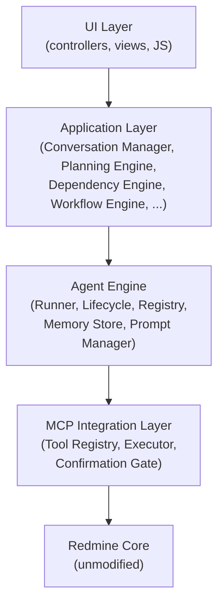
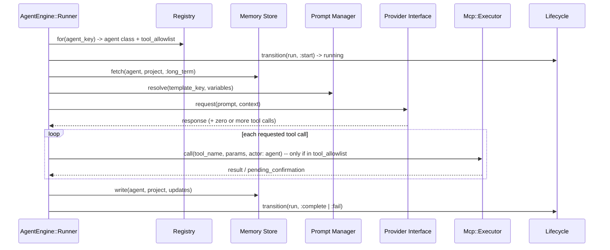

# Phase 2 — Core Technical Architecture — redmineflux_agentos

**Status**: Specification only. No Ruby, Rails, migrations, controllers, models, or code of any kind exists in or is implied by this document.
**Relationship to other docs**: [docs/PHASE1-SPECIFICATION.md](PHASE1-SPECIFICATION.md) §2 gave the layered view, the module responsibility table, and AD-1–AD-5 — this document is the **deepening** of that, not a replacement. [WORKFLOW.md](../WORKFLOW.md) describes the *operational* flows (what happens, in what order, from a user/agent perspective); this document describes the *internal component design* that implements those flows (what classes exist, what they own, how they talk to each other). Where WORKFLOW.md flagged something "forward-looking" (Event Bus, pause/resume), this document is where that gets a real design.

---

# Part A — Architecture

## A.1 Overall Plugin Architecture

AgentOS is a standard Redmine plugin (`init.rb`, `Redmine::Plugin.register`, no core patches — CLAUDE.md rule), structured as a layered Rails engine internally. The layering from [docs/PHASE1-SPECIFICATION.md](PHASE1-SPECIFICATION.md) §2.1 is the contract; this section adds the dependency-direction rule that makes it enforceable in code review:



**Dependency direction rule**: a layer may only call the layer directly below it. The Agent Engine never calls a controller; the MCP Integration Layer never calls back up into the Agent Engine (it returns a result, it does not invoke agent logic). This is checked in code review the same way the "agents never touch ActiveRecord models directly" rule (AD-3) is checked — a `grep` for cross-layer constant references is a legitimate Gate 1 check once code exists.

**Plugin boundary**: everything AgentOS creates is a normal Redmine object (`Project`, `Issue`, `Version`, `WikiPage`, `TimeEntry`) reachable through Redmine's native UI (per `VISION.md` Project Scope) — AgentOS adds tables and behavior, it does not fork or wrap Redmine's own models.

## A.2 Service-Oriented Architecture

Business logic lives in **service objects**, never in controllers or (beyond persistence concerns) in models — this is already a Gate 1 checklist item in the global `CLAUDE.md`; this section defines the one canonical shape every service in this plugin follows, so Gate 1 review has something concrete to check against:

```
RedminefluxAgentos::Services::{Noun}::{Verb}Service
  .call(**args) -> Result
```

- **One public entry point**: `.call` (class method, delegates to an instance). No service exposes more than one meaningfully-callable public method — if a class wants two, it's two services.
- **Result object, not exceptions, for expected failures**: returns an object responding to `success?`, `value`, `errors` — e.g. "SRS not yet approved" is a Result failure, not a raised exception, because it's an expected outcome the caller (a controller, another service) must branch on. Exceptions are reserved for the Error Handling Strategy's actual error classes (§B.7) — unexpected conditions.
- **Constructor takes everything the service needs**: no service reaches for `User.current` or other ambient global state internally except where explicitly documented (the MCP Executor is the one place `User.current` scoping is load-bearing — see §B.8) — everything else is passed in, so services are testable without controller/request context.
- **Services own transactions**: if a service writes to more than one table, the service wraps it in `ActiveRecord::Base.transaction`, not the caller.

Example shapes: `RedminefluxAgentos::Services::Requirements::GenerateSrsService`, `RedminefluxAgentos::Services::Dependencies::ClearBlockerService`, `RedminefluxAgentos::Services::Mcp::ExecuteToolService`.

## A.3 SOLID Design Principles

| Principle | How it's applied here |
|---|---|
| **Single Responsibility** | One agent role = one class (`lib/redmineflux_agentos/agents/{role}_agent.rb`, per [docs/AGENTS.md](AGENTS.md)); one service = one `.call` method (§A.2); the Workflow Engine's state machine is a separate class from the models whose state it manages. |
| **Open/Closed** | New agent roles or new MCP tools are added by registering into `AgentManager::Registry` / `Mcp::ToolRegistry` (§A.6, new entries), not by modifying the Runner or Executor. Adding a role never requires an `if agent.key == :new_role` branch anywhere in the Agent Engine. |
| **Liskov Substitution** | Every agent class implements the common contract from [docs/AGENTS.md](AGENTS.md) (input/output/memory/tools/communication/workflow) — the Runner calls that contract uniformly and never special-cases a specific agent's class. Any agent can be swapped for a stub/test double implementing the same contract. |
| **Interface Segregation** | An agent depends only on the MCP tools in its own `tool_allowlist` ([docs/MCP-TOOLS.md](MCP-TOOLS.md) permission model) — it is never handed the full `Mcp::ToolRegistry`, only a scoped view of it. |
| **Dependency Inversion** | The Agent Engine and Conversation Manager depend on the **Provider Interface** (an abstraction — see [ROADMAP.md](../ROADMAP.md) Phase 3), never on `MockProvider` or a future `AnthropicProvider` concretely. The dependency points at the interface; the concrete provider is injected via configuration (§B.6). |

## A.4 Module Responsibilities (expanded)

[docs/PHASE1-SPECIFICATION.md](PHASE1-SPECIFICATION.md) §2.2 named the modules and proposed classes. This table adds what each module's public interface actually needs to expose, so a future implementation task can be scoped directly from it:

| Module | Owns | Public interface (key methods) | Depends on |
|---|---|---|---|
| Agent Engine | Agent lifecycle (§A.6) | `Runner.execute(agent_run)`, `Lifecycle.transition(agent_run, event)`, `Registry.for(agent_key)` | Prompt Manager, Memory Store, Provider Interface, MCP Integration |
| Prompt Manager | Template resolution (§A.10) | `TemplateResolver.resolve(key, agent:, variables:)` | Cache Strategy (§B.3) |
| Conversation Manager | Conversation state machine (§A.8) | `Session.start(user, project)`, `Session#submit(text)`, `Session#status` | Requirement Analyzer, Agent Engine |
| Dependency Engine | Ticket DAG + agent unblocking | `Graph.add_edge(task, depends_on)`, `Scheduler.on_issue_closed(issue)` | Event Bus (§A.7) |
| Workflow Engine | State machines (agent_run, ticket status) | `StateMachine.transition(record, event)`, emits events on every transition | Event Bus |
| MCP Integration | Tool registry, execution, confirmation gate | `ToolRegistry.tools_for(agent)`, `Executor.call(tool_name, params, actor:)` | Redmine core models |
| Memory Store | Agent memory read/write (§A.9) | `Repository.fetch(agent, project, scope, key)`, `Repository.write(...)` | none (leaf) |
| Token Manager / Cost Tracker | Usage aggregation | `Tracker.record(agent_run, usage)`, `Calculator.rollup(project, period)` | none (leaf) |

Modules not re-tabled here (Release Planner, Sprint Planner, Ticket Generator, Notification Center, Reporting System, Configuration, Permission Manager, Audit Logs, Activity History) are unchanged from `docs/PHASE1-SPECIFICATION.md` §2.2 — no new decisions were needed for them at this phase.

## A.5 Agent Engine Architecture

Three classes, each with one job:

- **`AgentEngine::Registry`** — maps an agent key (`:project_manager`, `:database_agent`, ...) to its class, its `tool_allowlist`, and its enabled/disabled flag (from `redmineflux_agentos_agents.config_json`). This is the Open/Closed extension point (§A.3) — adding an 18th agent role is a new registry entry, not a Runner change.
- **`AgentEngine::Lifecycle`** — owns the `agent_runs.status` state machine exactly as specified in [WORKFLOW.md](../WORKFLOW.md) §8 (`queued → running → waiting_on_dep → completed/failed → dead/cancelled`). Every transition is delegated to `WorkflowEngine::StateMachine` (§A.7) so agent-run transitions and ticket-status transitions share one state-machine implementation, not two.
- **`AgentEngine::Runner`** — executes one `agent_run`, end to end:



**Concurrency model**: the Runner executes inside a background job (§B.1), one job per `agent_run`. Per-project and global concurrency are enforced by a `ConcurrencyGuard` (§B.9) checked before a queued run is allowed to transition to `running` — this is what makes the NFR "per-project and global concurrency caps configurable" ([docs/PHASE1-SPECIFICATION.md](PHASE1-SPECIFICATION.md) §1.3) concrete rather than aspirational.

## A.6 Workflow Engine

One generic `WorkflowEngine::StateMachine` class, configured (not subclassed) for each of the two state machines this plugin needs:

1. **Agent run state machine** — states/transitions per [WORKFLOW.md](../WORKFLOW.md) §8.
2. **Ticket status workflow** — states/transitions per [WORKFLOW.md](../WORKFLOW.md) §14 (`Backlog → Ready → InProgress → CodeReview → Testing → Completed → Released`).

Configuration is declarative (a transition table: `{from:, to:, event:, guard:}`), not a chain of `if/elsif`. Every successful transition publishes an event on the Event Bus (§A.7) — this is the single place both state machines hand off to the rest of the system, so the Dependency Engine, Notification Center, and Dashboard read-models all react to the same event stream regardless of which state machine produced it.

**Guard clauses**: a transition can be conditional (e.g. `waiting_on_dep → queued` only fires if the specific `blocking_issue_id` matches the issue that just closed) — guards are plain predicates passed in the transition config, not special-cased in the engine.

## A.7 Event Bus

This is the concrete design for what [WORKFLOW.md](../WORKFLOW.md) §15 flagged as forward-looking. **Decision: build it on `ActiveSupport::Notifications`**, already part of Rails/Redmine's dependency graph — no new gem, no new infrastructure (no Redis pub/sub requirement, keeping the "no external data egress in v1" invariant from [docs/SECURITY-COMPLIANCE-OVERVIEW.md](SECURITY-COMPLIANCE-OVERVIEW.md) untouched, and keeping Phase 10 implementation simple).

- **Publish**: `RedminefluxAgentos::EventBus.publish("agentos.issue_status_changed", issue: issue, from:, to:)` — a thin wrapper over `ActiveSupport::Notifications.instrument`, namespaced under `agentos.*` so it can never collide with Redmine core or another plugin's instrumentation.
- **Subscribe**: subscribers register at plugin boot (in `init.rb` or a dedicated initializer), e.g. the Dependency Engine subscribes to `agentos.issue_status_changed` and re-queues any `agent_run` whose `blocking_issue_id` matches.
- **In-process, synchronous by default**: subscribers run inline, in the same process/thread that published the event (matching `ActiveSupport::Notifications`' default behavior) — this is intentional for v1: it keeps causality simple (a ticket close and its "cleared" side effect happen in one transaction-adjacent step) and avoids introducing distributed-systems failure modes (lost messages, ordering) that a real message queue would add for no v1 benefit.
- **Persistence is via existing tables, not the bus itself**: the event stream is not the source of truth — `agent_runs`, `mcp_tool_calls`, `execution_logs`, and `audit_logs` are (per [WORKFLOW.md](../WORKFLOW.md) §15's own note). The bus is a dispatch mechanism layered on top of durable rows, so a subscriber that was down for a moment doesn't lose data — the Dependency Engine's own periodic health-check tick (mentioned in [docs/AGENTS.md](AGENTS.md) Project Manager Agent workflow) is the backstop for anything a live subscriber missed.
- **Event catalog**: the table in [WORKFLOW.md](../WORKFLOW.md) §15 is the authoritative event name list — this section does not duplicate it, only the dispatch mechanism.

## A.8 Conversation Architecture

`ConversationManager::Session` wraps one `redmineflux_agentos_conversations` row and its state machine (`active/awaiting_user/srs_review/approved/closed`, per [docs/DATABASE-SCHEMA.md](DATABASE-SCHEMA.md)). It does not itself talk to the Provider — it delegates each turn to the Requirement Analyzer service, which is what actually calls the Agent Engine for the Requirement Analyst Agent's turn. This keeps `Session` a thin state/persistence wrapper (Single Responsibility, §A.3) rather than a god-object that also knows about prompts and providers.

Sequence for one conversation turn is exactly [WORKFLOW.md](../WORKFLOW.md) §6 — this section adds only the ownership boundary: `Session` persists the `messages` row and advances `conversations.status`; it calls out to the Agent Engine Runner (§A.5) for the actual agent turn, it does not duplicate Runner logic.

## A.9 Memory Architecture

`MemoryStore::Repository` is a thin, leaf-level (no dependencies on other modules) data access class over `redmineflux_agentos_agent_memories`:

- `fetch(agent, project, scope: :long_term)` — returns all non-expired rows for `(agent_id, project_id, scope)`.
- `write(agent, project, scope, key, value)` — upserts on the `(agent_id, project_id, scope, key)` unique index (per [docs/DATABASE-SCHEMA.md](DATABASE-SCHEMA.md)).
- `sweep_expired` — deletes `short_term` rows past `expires_at`; run as a scheduled background job (§B.1), not on every read, so read latency isn't coupled to cleanup.

`project_id: nil` rows (cross-project memory) are fetched via the same method with `project: nil` — no separate code path, since the unique index already treats it as a normal (if project-less) key.

## A.10 Prompt Architecture

`PromptManager::TemplateResolver.resolve(key, agent:, variables:)`:

1. Looks up the single `is_active: true` row for `key` (+ `agent_id` if role-specific, else the shared/system template) in `redmineflux_agentos_prompt_templates` — via the Cache Strategy (§B.3), not a live query on every resolve.
2. Validates every variable declared in `variables_json` is present in the `variables` argument — a missing required variable raises a `PromptVariableMissingError` (§B.7), it never silently renders a blank.
3. Interpolates and returns the composed prompt string.

This resolver is the only code path that reads prompt templates — the Agent Engine Runner never reads `redmineflux_agentos_prompt_templates` directly, keeping prompt versioning/caching logic in exactly one place.

---

# Part B — Cross-Cutting Strategies

## B.1 Background Job Strategy

**Decision, informed by the sibling `redmineflux_devops` plugin's already-implemented, tested pattern**: every job is a plain `ApplicationJob` (falling back to `ActiveJob::Base` if `ApplicationJob` isn't defined) — adapter-agnostic, so AgentOS makes no assumption about whether the host Redmine runs Sidekiq, Resque, Delayed Job, or the default async adapter. This resolves Open Question #2 in [docs/PHASE1-SPECIFICATION.md](PHASE1-SPECIFICATION.md) §7 as: *don't hardcode a backend — inherit whatever the host already runs, exactly as `redmineflux_devops` does.*

```ruby
class RedminefluxAgentos::AgentRunJob < (defined?(ApplicationJob) ? ApplicationJob : ActiveJob::Base)
  queue_as :agentos_default
  retry_on StandardError, wait: ->(executions) { (executions**2) + 1 }, attempts: 3
  discard_on ActiveRecord::RecordNotFound
end
```

Jobs identified so far: `AgentRunJob` (executes one `agent_run` via the Runner, §A.5), `McpToolCallJob` (only for tool calls explicitly deferred rather than executed inline — most are synchronous within `AgentRunJob`), `MemorySweepJob` (§A.9), `CostRollupJob` (daily `cost_trackings` aggregation).

## B.2 Queue Strategy

| Queue | Used by | Rationale |
|---|---|---|
| `agentos_interactive` | Conversation turns (a user is actively waiting on a response) | Lowest latency priority |
| `agentos_default` | Agent runs on tickets (dependency-driven, no human waiting synchronously) | Normal priority |
| `agentos_background` | Reporting, cost rollups, memory sweeps | Lowest priority, batched |

Queue *names* are AgentOS's to define; queue *priority/worker allocation* is the host Redmine's job runtime configuration (Sidekiq concurrency settings, etc.) — AgentOS does not assume or require a specific priority mechanism, consistent with B.1's adapter-agnostic decision.

## B.3 Cache Strategy

| Cached | Store | Invalidated on |
|---|---|---|
| Active prompt template per `key` (§A.10) | `Rails.cache` (host-configured adapter — memory store in dev is fine, Redis/Memcached in production; AgentOS does not mandate one) | New template version activated |
| Agent registry (`Registry.for`, §A.5) | `Rails.cache` | Agent `config_json` updated (enable/disable, tool_allowlist edit) |
| Per-project dependency graph snapshot | `Rails.cache`, keyed by `project_id` | Any `redmineflux_agentos_dependencies` insert/delete for that project |

All three are **explicit-invalidation caches**, not time-based expiry — per the NFR in [docs/PHASE1-SPECIFICATION.md](PHASE1-SPECIFICATION.md) §1.3 ("cached in-process with explicit invalidation on edit"). A cache entry is only ever wrong if an invalidation hook was missed, which is exactly the kind of thing a Gate 3 predicted-bug check should look for once this is implemented.

## B.4 Retry Strategy

Three distinct, complementary retry layers — this table exists specifically so they're never confused with each other during implementation:

| Layer | Mechanism | Bound |
|---|---|---|
| Agent run | `agent_runs.attempts` / `max_attempts`, `failed → queued` transition (WORKFLOW.md §8) | Default 3, configurable per agent |
| Background job | `ApplicationJob#retry_on` exponential backoff (§B.1) | 3 attempts, matches `redmineflux_devops` precedent |
| MCP tool call | Not retried automatically — idempotency-keyed (`ai_task_id`-derived key, per [docs/MCP-TOOLS.md](MCP-TOOLS.md)) so a retried *agent run* can safely re-attempt a tool call without double-creating a ticket | N/A — safety net for the layers above, not its own retry loop |

## B.5 Logging Strategy

[WORKFLOW.md](../WORKFLOW.md) §20 is authoritative for *what* is logged where (`execution_logs`, `mcp_tool_calls`, `audit_logs`). This section adds the *how*:

- All AgentOS log lines are structured (key-value, not free-text interpolation), tagged with `agent_run_id` where one exists, via `Rails.logger.tagged("agentos", "run:#{agent_run_id}")` — this is what makes "correlated by `agent_run_id`" (NFR, §1.3) actually greppable in a shared Redmine log file, not just a database-side correlation.
- `execution_logs` rows and log-file lines are complementary, not duplicates: the DB row is the durable, queryable record (Execution History screen); the log-file line is for live tailing during development/on-call debugging.

## B.6 Configuration Strategy

`Configuration::Store` reads `redmineflux_agentos_configurations`:

- **Precedence**: a project-scoped row (`project_id: <id>`) overrides a global-default row (`project_id: nil`) for the same `key`. `Store.get(key, project: nil)` implements this lookup order internally — callers never manually check both rows.
- **Caching**: config values are cached (§B.3-style, explicit invalidation on write) since they're read on nearly every agent run (e.g. "which provider is active").
- **Hot vs. restart-required**: most keys (active provider, cost rate card, concurrency caps) take effect on next read (hot). A small number of keys that affect plugin *registration* (module enablement) require a Redmine restart — this table must be maintained as new config keys are added, not assumed.

## B.7 Error Handling Strategy

A small exception hierarchy, all under one namespace so a top-level rescue can classify any AgentOS-originated failure:

```
RedminefluxAgentos::Error (base)
├── ProviderError            # Provider Interface call failed (§A.5)
├── PromptVariableMissingError  # §A.10
├── McpToolError
│   ├── PermissionDeniedError    # tool_allowlist or Redmine authorize failed
│   └── ConfirmationRequiredError
├── DependencyCycleError     # insert-time cycle check (DATABASE-SCHEMA.md)
└── ConcurrencyLimitError    # §B.9
```

- **Where rescued**: `AgentEngine::Runner` rescues `RedminefluxAgentos::Error` subclasses and transitions the run to `failed` with `error_message` set (never lets one bubble up and crash the job silently) — this is what makes the NFR "the user sees a clear, actionable error and can retry" real rather than aspirational. Unrecognized (non-`RedminefluxAgentos::Error`) exceptions are also caught at this boundary, logged with full backtrace, and treated the same as `ProviderError` for retry purposes — nothing escapes the Runner un-classified.
- **Controllers** rescue at the `ApplicationController` level and render a structured JSON error body (`{ error: { type:, message: } }`) for API/JS callers — never a raw 500 with a stack trace.

## B.8 Security Strategy

This is the code-level enforcement of [docs/SECURITY-COMPLIANCE-OVERVIEW.md](SECURITY-COMPLIANCE-OVERVIEW.md)'s principles — that document is the *why*, this is *where in the architecture it's actually enforced*:

| Principle (from SECURITY-COMPLIANCE-OVERVIEW.md) | Enforced where |
|---|---|
| Least privilege | `Mcp::Executor.call` — first line is a guard clause checking `tool_name` against `agent.tool_allowlist`; raises `McpToolError::PermissionDeniedError` before any Redmine-model code runs |
| Explicit user context | Every `Mcp::Executor.call` requires an explicit `actor:` (a `User` instance) argument — there is no default/optional actor, so it is a compile-time-visible mistake (missing required keyword arg) to forget it, not a silent superuser fallback |
| Human-in-the-loop for irreversible actions | `Mcp::Executor.call` checks `requires_confirmation` on the tool *before* execution and short-circuits to writing a `pending_confirmation` row instead of calling the Redmine model, per [docs/MCP-TOOLS.md](MCP-TOOLS.md) |
| Auditability | `Mcp::Executor.call` writes its `mcp_tool_calls` row in the same method, before and after execution — an agent/service cannot call a tool through any path that skips logging, because there is only one path (§A.4, MCP Integration owns `Executor.call` as its single write entry point) |
| Secrets never logged | `Mcp::Executor` redacts `params_json` via an explicit allow-list of loggable param keys (not a deny-list of secret keys) — new params are unloggable by default until explicitly whitelisted, which fails safe |

## B.9 Performance Strategy

- **No N+1 in dashboards**: every Dashboard presenter (§A.4) queries `ai_tasks`/`token_usages`/`cost_trackings` directly (already denormalized for this purpose per [docs/DATABASE-SCHEMA.md](DATABASE-SCHEMA.md)) — never by joining live through `agent_runs` → `issues`, and any association accessed in a loop uses `.includes` (standing Gate 2 checklist item).
- **Concurrency caps as a real mechanism, not a config value nobody reads**: `RedminefluxAgentos::ConcurrencyGuard.acquire(project_id)` — a row-locked counter (or equivalent) checked by `AgentEngine::Lifecycle` before allowing `queued → running`; if the per-project or global cap is hit, the run stays `queued` (not an error) until a slot frees on another run's completion.
- **No synchronous LLM/MCP calls in a web request** — already AD-4 in [docs/PHASE1-SPECIFICATION.md](PHASE1-SPECIFICATION.md); this section just confirms the Background Job Strategy (§B.1) is the enforcement mechanism, not a suggestion controllers are trusted to follow.

## B.10 Scalability Strategy

- **Horizontal**: throughput scales by adding more job workers (Sidekiq processes, etc.) — AgentOS code doesn't change, because B.1's adapter-agnostic job design means it never assumes a fixed worker count or in-process execution.
- **Per-project isolation**: the Concurrency Guard (§B.9) caps are both global *and* per-project, so one project with a burst of agent activity cannot starve every other project's agent runs — a fairness property, not just a throughput cap.
- **Database**: relies on the indexes already specified in [docs/DATABASE-SCHEMA.md](DATABASE-SCHEMA.md) (`(status)`, `(agent_id, status)`, `(project_id, status)` on `agent_runs`, etc.) — no new indexing decisions are introduced here; this section exists to confirm scalability was already designed for at the schema level, not bolted on later.
- **Out of scope for v1**: multi-tenancy / multiple Redmine instances sharing one AgentOS deployment — per `VISION.md` Assumptions & Constraints, one AgentOS installation serves one Redmine instance.
