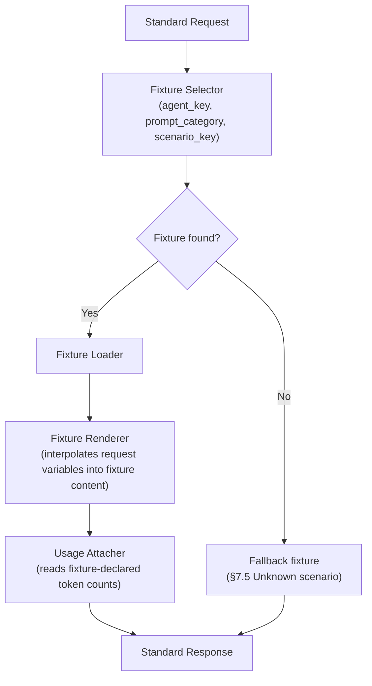

# Phase 3 — Mock AI Provider Foundation — redmineflux_agentos

**Status**: Specification only. No Ruby, Rails, migrations, controllers, models, routes, views, JavaScript, CSS, tests, or implementation code exists in or is implied by this document.
**Objective**: complete the AI provider architecture before any implementation. The first version integrates with **no real LLM provider**. The architecture is completely provider-agnostic. The entire system communicates only through the **Provider Interface** defined here.
**Relationship to other docs**: [docs/PHASE2-CORE-TECHNICAL-ARCHITECTURE.md](PHASE2-CORE-TECHNICAL-ARCHITECTURE.md) already established the Agent Engine Runner (§A.5), Prompt Manager (§A.10), Configuration Strategy (§B.6), Error Handling Strategy (§B.7), and Logging Strategy (§B.5) — this document does not re-derive those, it defines the Provider-specific contract those modules call into, and the Mock implementation of that contract. [WORKFLOW.md](../WORKFLOW.md) §7, §18, and §19 sketched the Provider/Mock AI/Token workflows at an operational, forward-looking level — this document is where those get a real, implementable design.

---

## 1. Mock AI Provider Architecture

### 1.1 Provider responsibilities

The Mock AI Provider's only job is to answer a Standard Request (§2) with a Standard Response (§2), deterministically, using no external network call. It owns exactly four things: fixture lookup, fixture rendering, simulated usage/cost attachment, and error simulation for testing failure paths. It does **not** own prompt composition (Prompt Manager, Phase 2 §A.10), agent orchestration (Agent Engine Runner, Phase 2 §A.5), or MCP execution (Phase 2 §A.4) — those call *into* the Provider, the Provider never calls back out to them.

### 1.2 Internal architecture



Four internal, single-responsibility pieces: **Fixture Selector** (key resolution, §7.1), **Fixture Loader** (reads the fixture file), **Fixture Renderer** (variable interpolation into the fixture's canned content — reusing the same `{{variable}}` syntax as Prompt Management, §5.5, so authors only learn one templating convention), **Usage Attacher** (copies the fixture's declared `prompt_tokens`/`completion_tokens` into the response, §9).

### 1.3 Request lifecycle

Request lifecycle = Provider Lifecycle §3 steps "Prompt preparation" through "Response generation" — this section does not duplicate that; it is the pointer between the two.

### 1.4 Response lifecycle

A response is either a **content response** (agent's turn is a text/structured artifact — e.g. an SRS fragment) or a **tool-call response** (agent's turn should result in one or more MCP tool calls — e.g. "create these 5 tickets"), or both (content plus tool calls, e.g. a status update message *and* an `update_issue` call). The `finish_reason` field (§2.2) tells the Agent Engine Runner which case it's in, so the Runner's tool-call loop (Phase 2 §A.5 sequence diagram) only runs when there's something to run.

### 1.5 Extension points

Two, and only two, points where this architecture is meant to be extended without changing anything else in the system:

1. **New provider implementation** — implements the same Provider Interface (§2); registered into `Provider::Registry` (§3.1). This is the Dependency-Inversion extension point (Phase 2 §A.3) — see §11 Future Migration Plan.
2. **New fixture** — adding a `.yml` file under the configured fixture directory (§10) to cover a new scenario, without touching the Fixture Selector/Loader/Renderer code. This is the Open/Closed extension point for the Mock Provider specifically.

Nothing else is an intended extension point — e.g. the token-simulation formula (§9.1: read from the fixture, not computed) is deliberately not pluggable in v1, to keep the Mock Provider's behavior fully deterministic and auditable.

---

## 2. Provider Interface Design

Every provider — Mock today, a real one from v2 (`docs/PRODUCT-ROADMAP.md`) — implements this same contract. Nothing above the Provider Interface (Conversation Manager, Agent Engine Runner, any UI) is allowed to reference a concrete provider class; everything is written against these four models.

### 2.1 Standard request model

| Field | Type | Notes |
|---|---|---|
| `agent_key` | string | Which agent role is making this call (`docs/AGENTS.md` key), or `nil` for a direct conversation turn not yet attributed to an agent |
| `prompt_category` | string | One of the 11 categories in §6 |
| `prompt` | string | Fully composed prompt text (already resolved by Prompt Manager, Phase 2 §A.10 — the Provider never resolves templates itself) |
| `variables` | hash | The same variables used to compose `prompt` — passed through so the Mock Provider's Fixture Renderer (§1.2) can interpolate them into canned fixture content too |
| `conversation_id` / `agent_run_id` | integer, nullable | Correlation IDs for logging (Phase 2 §B.5) |
| `context` | array | Prior messages / memory / knowledge-base excerpts the Conversation/Agent Engine assembled (§4.2, §5.2) |
| `tools_available` | array of strings | The calling agent's MCP tool allow-list ([docs/MCP-TOOLS.md](MCP-TOOLS.md)) — tells the provider which tool names it's allowed to request in `tool_calls` |
| `max_tokens`, `temperature` | number, nullable | Passed through for a real provider; ignored (but accepted, per the contract) by the Mock Provider |
| `stream` | boolean | Requested streaming mode — see §2.5 |
| `idempotency_key` | string | Base key propagated to any resulting MCP tool call. **When a single turn produces multiple `tool_calls` (§2.2), each call's effective idempotency key is `{idempotency_key}-{n}`, where `n` is the call's zero-based index in the `tool_calls` array** — never the same raw key reused across calls. Without this, `Mcp::Executor`'s idempotency check ([docs/MCP-TOOLS.md](MCP-TOOLS.md)) would see 5 `create_issue` calls from one turn as 5 retries of the *same* call and silently create only 1 ticket instead of 5. This is a correctness requirement, not an implementation detail. |

### 2.2 Standard response model

| Field | Type | Notes |
|---|---|---|
| `content` | string, nullable | Text/structured artifact (e.g. SRS Markdown fragment) |
| `tool_calls` | array, nullable | Zero or more `{tool_name, params}` the Agent Engine Runner should execute via `Mcp::Executor` (Phase 2 §A.5) — see the idempotency-suffixing rule under `idempotency_key` (§2.1) |
| `memory_updates` | array, nullable | Zero or more `{scope, key, value}` writes for `MemoryStore::Repository` (Phase 2 §A.9) — this is what the Runner's "write memory updates" completion-handling step (§5.6, Phase 2 §A.5) actually writes. The Provider (Mock or real) declares explicitly what should be remembered; the Runner never infers memory content by re-parsing `content` |
| `usage` | hash | `{prompt_tokens, completion_tokens, total_tokens}` — §9 |
| `finish_reason` | enum | `content` \| `tool_calls` \| `content_and_tool_calls` \| `error` |
| `provider`, `model` | string | Which provider/model actually answered (`mock` / `n/a` in v1) |
| `latency_ms` | number | Simulated in v1 (§3, step "Mock execution"). **A fixed value — default 250ms, fixture-overridable, never randomized.** Randomizing it would break the determinism guarantee (§1) for any test asserting on timing-adjacent behavior; "never zero" only means it must be a realistic, non-trivial constant, not that it may vary between identical runs. |
| `raw` | hash, optional | Provider-specific passthrough for debugging — never relied upon by any caller, per the interface-only rule |

### 2.3 Error model

| Field | Type | Notes |
|---|---|---|
| `error_code` | enum | `missing_fixture` \| `invalid_template` \| `timeout_simulated` \| `configuration_error` \| `unknown_scenario` \| `variable_missing` |
| `message` | string | Human-readable, safe to surface to a user (per NFR: "clear, actionable error") |
| `retryable` | boolean | Drives whether the Agent Engine's retry layer (Phase 2 §B.4) re-attempts |
| `provider` | string | Which provider raised it |

Maps directly onto the exception hierarchy in Phase 2 §B.7 — see §8 of this document for the Mock-specific subclasses.

### 2.4 Capability model

Declared once per provider at registration (§3.1), queried by callers that need to adapt (e.g. a future UI streaming indicator):

| Capability | Mock Provider value | Why |
|---|---|---|
| `supports_tool_calling` | `true` | Agents must be able to request MCP tool calls even from a mock backend, or nothing downstream of Phase 1 can be exercised end-to-end |
| `supports_streaming` | `false` | v1 returns complete responses atomically (§2.5) |
| `max_context_tokens` | a large fixed constant (e.g. `1_000_000`) | Fixture-based responses are never actually context-limited; the field exists so the interface shape matches what a real provider must report |
| `supported_categories` | the 11 categories in §6 | A provider is not required to support every category — a real provider integration could start with a subset; the interface must expose this so calling code can check rather than assume |

### 2.5 Tool-calling support

An agent's "turn" can request MCP tool calls (e.g. "create these 3 tickets") — this is not a v2-only feature bolted on later, it is load-bearing for v1 (every ticket/project/wiki-page creation *is* a tool call requested by an agent's Provider response). The Mock Provider simulates this by having fixtures declare a canned `tool_calls` array (§7); a real provider (v2+) would populate the same field from the vendor's own function/tool-calling API. The Agent Engine Runner (Phase 2 §A.5) is written against the `tool_calls` field only — it has no branch for "is this the mock provider or a real one."

**Idempotency across multiple tool calls in one turn**: when `tool_calls` has more than one entry, the Runner must derive each call's idempotency key as `{idempotency_key}-{n}` (§2.1), not reuse the turn's raw `idempotency_key` for every entry. This is required for correctness (not just recommended) — reusing one key across N calls would make `Mcp::Executor`'s idempotency check treat calls 2..N as retries of call 1 and silently drop them.

### 2.6 Streaming compatibility

The `stream` request field and `supports_streaming` capability flag exist in the interface from day one, even though the Mock Provider always ignores `stream: true` and returns a complete, non-streamed response (`supports_streaming: false`). This is deliberate: adding streaming later (a real provider, v2+) must not require changing the Standard Request/Response Model shape — only a provider's *handling* of an already-defined field changes. Any v1 caller that checks `capability.supports_streaming` before attempting to render partial output already degrades correctly against the Mock Provider without special-casing it.

### 2.7 Configuration contract

Every provider accepts one configuration object at initialization (§3.1) with this shape — a provider that doesn't need a field (Mock doesn't need `credentials`) simply ignores it, but every provider must accept the same shape:

| Field | Mock Provider | Future real provider |
|---|---|---|
| `provider_key` | `"mock"` | `"openai"` / `"anthropic"` / etc. |
| `model` | `nil` | vendor model identifier |
| `credentials` | `nil` (never present — §12.3) | API key / token, loaded via encrypted config (CLAUDE.md rule: never in logs/JSON) |
| `rate_card_key` | points to a simulated rate card (§10, Cost Rules) | points to the vendor's real pricing |
| `timeout_ms` | used only for timeout-simulation testing (§8.3) | real request timeout |
| `extra` | fixture directory path (§10) | provider-specific options (e.g. org ID) |

---

## 3. Provider Lifecycle

1. **Initialization** — at plugin boot, every available provider class registers itself into `Provider::Registry` (mirrors `AgentEngine::Registry`'s pattern from Phase 2 §A.5 — same Open/Closed shape, deliberately, so the codebase has one registration idiom, not two).
2. **Configuration loading** — `Configuration::Store.get("active_provider", project: ...)` (Phase 2 §B.6) resolves which provider key is active; its configuration object (§2.7) is loaded via the same Store.
3. **Provider selection** — `Provider::Registry.active(project:)` returns the resolved provider instance. In v1 this always resolves to the Mock Provider (§12 gate).
4. **Prompt preparation** — delegated entirely to Prompt Manager (Phase 2 §A.10); the Provider Lifecycle receives an already-composed `prompt` string, it never touches `prompt_templates` directly.
5. **Mock execution** — Fixture Selector → Loader → Renderer (§1.2).
6. **Response generation** — wraps the rendered fixture into the Standard Response Model (§2.2).
7. **Logging** — one `execution_logs` row per request/response pair, tagged with the prompt version actually used (§7 — immutability point) and `agent_run_id` (Phase 2 §B.5 tagging convention).
8. **Token simulation** — §9.
9. **Cost simulation** — §10 (Cost Rules).
10. **Cleanup** — a no-op for the Mock Provider (stateless, no connection pool) — the lifecycle hook exists so a future real provider (e.g. holding an HTTP client) has a defined place to release resources; this keeps the interface symmetric across providers rather than adding the hook only when it's first needed.

---

## 4. Conversation Flow

This section adds the Provider-specific detail to the already-specified operational flow in [WORKFLOW.md](../WORKFLOW.md) §6 and the ownership boundary in [docs/PHASE2-CORE-TECHNICAL-ARCHITECTURE.md](PHASE2-CORE-TECHNICAL-ARCHITECTURE.md) §A.8 (`ConversationManager::Session`).

1. **Conversation lifecycle** — unchanged from `redmineflux_agentos_conversations.status` (`active/awaiting_user/srs_review/approved/closed`, per [docs/DATABASE-SCHEMA.md](DATABASE-SCHEMA.md)).
2. **Context loading** — `Session` assembles the Standard Request's `context` array from prior `messages` rows in the conversation (bounded — not the entire history unbounded, to keep `prompt` composition NFR-compliant on size) plus any relevant `knowledge_base_entries`.
3. **Prompt composition** — delegated to Prompt Manager (Phase 2 §A.10) using the `requirement_analyst.*` category templates (§6).
4. **Provider interaction** — `Session` calls the active Provider (§3.3) with the composed Standard Request; it does not know or care that it's the Mock Provider.
5. **Response routing** — the Response's `content` becomes a new `messages` row (`role: agent`); `tool_calls` are not expected at the conversation stage in v1 (the Requirement Analyst Agent's MCP tool grant is limited to `create_wiki_page` for publishing an *approved* SRS, per [docs/AGENTS.md](AGENTS.md) — any `tool_calls` returned before SRS approval would be a Gate 2-relevant defect, not an expected path).
6. **Persistence** — `messages.tokens_used` is populated directly from the Response's `usage.total_tokens` (§9) — no separate token-counting pass.

---

## 5. Agent Execution Flow

This section adds the Provider-specific detail to [docs/PHASE2-CORE-TECHNICAL-ARCHITECTURE.md](PHASE2-CORE-TECHNICAL-ARCHITECTURE.md) §A.5's Runner sequence diagram — it does not redraw that diagram, only annotates the two steps that touch the Provider Interface.

1. **Agent invocation** — `AgentEngine::Runner` picks up a `queued` `agent_run` (Phase 2 §A.5/§A.6).
2. **Context loading** — Runner calls `MemoryStore::Repository.fetch` (Phase 2 §A.9) and assembles `context`.
3. **Prompt resolution** — Runner calls `PromptManager::TemplateResolver.resolve` (Phase 2 §A.10) for the agent's current step, producing `prompt` + `variables`.
4. **Provider interaction** — Runner builds the Standard Request (§2.1, including `tools_available` from the agent's `tool_allowlist`) and calls the active Provider.
5. **Workflow continuation** — the Response's `finish_reason` (§2.2) determines the next step: `tool_calls` → Runner's tool-execution loop (Phase 2 §A.5 diagram) via `Mcp::Executor`; `content` only → Runner proceeds straight to completion handling.
6. **Completion handling** — Runner writes every entry in the Response's `memory_updates` array (§2.2) via `MemoryStore::Repository.write` (Phase 2 §A.9) — this is the concrete answer to what Phase 2 §A.5's diagram left as "write memory updates": the Provider declares explicitly what to remember, the Runner never infers it by re-parsing `content`. Runner then transitions the `agent_run` via `AgentEngine::Lifecycle` (`running → completed`/`failed`, per [WORKFLOW.md](../WORKFLOW.md) §8), and records `token_usages`/`cost_trackings` rows from `usage` (§9, §10).

---

## 6. Prompt Management

This is the **content/process** design layered on top of Phase 2 §A.10's `PromptManager::TemplateResolver` **class** design — that section defined how resolution works; this section defines what gets resolved and the authoring rules around it.

- **Prompt lifecycle**: `draft` (being authored/edited) → `active` (the single `is_active: true` row for its `key`, per [docs/DATABASE-SCHEMA.md](DATABASE-SCHEMA.md)) → `superseded` (a newer version was activated). Matches the SRS's own draft/approved/superseded pattern (`docs/DATABASE-SCHEMA.md` `project_plans`) for consistency across the codebase.
- **Prompt versioning**: every edit is a new `version` row, never an in-place mutation of an active version — an in-flight `agent_run` that already resolved a template keeps using what it resolved (Phase 2 §A.10), so an admin editing a template mid-flight cannot retroactively change a run already in progress.
- **Categories**: the 11 in §6.1 below — each `prompt_templates.key` is namespaced `{category}.{step}` (e.g. `requirement_analysis.parse_idea`, `clarification_questions.generate_batch`).
- **Variables**: declared in `variables_json` (`docs/DATABASE-SCHEMA.md`); every declared variable is required unless explicitly marked optional — Prompt Manager's validation (Phase 2 §A.10) rejects a resolve call missing a required variable before ever reaching the Provider.
- **Validation**: syntactic (declared variables actually appear in `content`; no undeclared `{{var}}` reference — an authoring-time lint, not a runtime concern) and semantic (required variable present at resolve time — a runtime concern, §8.2).
- **Composition**: double-curly-brace interpolation, `{{variable_name}}` — no conditionals, no loops, no embedded logic in v1. This is a deliberate simplicity choice: v1's determinism goal (§1) is easiest to guarantee with a templating syntax that cannot itself introduce branching behavior. A richer template engine is a v2+ consideration only if a real, concrete need for conditional prompt content emerges.
- **Localization readiness — identified gap, not yet closed**: `redmineflux_agentos_prompt_templates` (per the already-approved [docs/DATABASE-SCHEMA.md](DATABASE-SCHEMA.md)) has no `locale` column. This document does not add one — schema changes are Phase 4/11's domain, not Phase 3's — but flags explicitly that true localization support requires a future schema migration (a `locale` column + a resolution rule for locale fallback), tracked here so it is not silently assumed solved. "Readiness" in v1 means the content/structure separation (`content` vs. `variables_json`) doesn't actively block adding that column later — it does not mean localization works today.

### 6.1 Prompt Template Library

| Category | Used by | Key variables | Purpose |
|---|---|---|---|
| Requirement Analysis | Requirement Analyst Agent | `{{idea_text}}`, `{{checklist_categories}}` | Parse a free-text idea into a structured requirement draft, detect gaps against the checklist ([docs/PHASE1-SPECIFICATION.md](PHASE1-SPECIFICATION.md) §1.1) |
| Clarification Questions | Requirement Analyst Agent | `{{gaps_detected}}`, `{{round_number}}` | Generate one batched question set |
| SRS Generation | Requirement Analyst Agent | `{{confirmed_answers}}`, `{{idea_text}}` | Produce SRS Markdown + JSON |
| Project Planning | Project Manager Agent | `{{srs_json}}` | Seed project/module/epic structure |
| Release Planning | Release Planner (module) | `{{epics}}`, `{{constraints}}` | Derive release list |
| Sprint Planning | Scrum Master Agent | `{{releases}}`, `{{velocity_assumption}}` | Derive sprint composition |
| Ticket Generation | Ticket Generator (module, invoked per tier agent) | `{{epic}}`, `{{acceptance_criteria_hints}}` | Decompose an epic into stories/tasks/subtasks |
| Dependency Analysis | Solution Architect Agent | `{{architecture_doc}}`, `{{ticket_set}}` | Seed the dependency DAG ([docs/DATABASE-SCHEMA.md](DATABASE-SCHEMA.md) `dependencies`) |
| Risk Analysis | Security Agent, Project Manager Agent | `{{architecture_doc}}`, `{{ticket_set}}` | Populate the risk register |
| Documentation | Documentation Agent | `{{closed_tickets}}`, `{{architecture_doc}}` | Generate/update wiki page content |
| Reporting | Reporting Agent | `{{dashboard_snapshot}}` | Generate report narrative text |

---

## 7. Mock Response Strategy

Deterministic, fixture-based responses exist for these 12 scenarios. Fixture selection is keyed by **`(agent_key, prompt_category, scenario_key)`** — never by hashing or matching the caller's free-text input (per [WORKFLOW.md](../WORKFLOW.md) §18) — at the file path convention:

```
{fixture_directory}/{agent_key}/{prompt_category}/{scenario_key}.yml
```

**Multi-round scenarios are distinct fixtures, not conditional content**: since Prompt Management (§6) deliberately has no conditional/branching syntax, a scenario whose content legitimately differs per iteration — the clearest example being Clarification Questions across rounds 1–3 (`docs/PHASE1-SPECIFICATION.md` §1.1) — cannot be one fixture that branches on `{{round_number}}` internally. Its `scenario_key` is round-qualified instead: `clarification_questions_round_1.yml`, `clarification_questions_round_2.yml`, etc. The Fixture Selector folds `variables.round_number` into the `scenario_key` lookup for any category where this applies; this is a selection-key rule, not a rendering-time branch, so determinism (§1) is preserved.

**Fixture file shape** (the concrete structure every fixture must have — shown here as an illustrative example for the "Create Project" scenario, not literal implementation code):

```yaml
# fixtures/mock_provider/project_manager/project_planning/create_project.yml
content: "Created project '{{project_name}}' with modules: {{module_list}}."
tool_calls:
  - tool_name: redmineflux_agentos_create_project
    params:
      name: "{{project_name}}"
      modules: "{{module_list}}"
usage:
  prompt_tokens: 420
  completion_tokens: 180
latency_ms: 250
finish_reason: content_and_tool_calls
memory_updates:
  - scope: long_term
    key: project_plan
    value: "{{project_name}} created with modules {{module_list}}"
```

Every field maps 1:1 onto the Standard Response Model (§2.2) — the Fixture Renderer (§1.2) interpolates `{{variable}}` placeholders (the same syntax as Prompt Management, §6) against the request's `variables` before returning it.

| Scenario | `prompt_category` | Response shape |
|---|---|---|
| Create Project | Project Planning | `tool_calls: [{tool_name: redmineflux_agentos_create_project, params: {...}}]` |
| Requirement Analysis | Requirement Analysis | `content` only (structured requirement draft) |
| Clarification Questions | Clarification Questions | `content` only (question batch); **round-qualified `scenario_key`**, see above |
| Requirement Summary | Requirement Analysis | `content` only |
| Project Plan | Project Planning | `content` + `tool_calls` (epics via `create_issue`) |
| Release Plan | Release Planning | `tool_calls: [{tool_name: redmineflux_agentos_create_version, ...}, ...]` |
| Sprint Plan | Sprint Planning | `content` only (sprints are plugin-owned, not MCP-created — AD-1, [docs/PHASE1-SPECIFICATION.md](PHASE1-SPECIFICATION.md) §2.3) |
| Ticket Creation | Ticket Generation | `tool_calls: [{tool_name: redmineflux_agentos_create_issue, ...}, ...]` (§7.2 generation rule; multiple calls in one turn use the `{idempotency_key}-{n}` suffixing rule, §2.1/§2.5) |
| Dependency Detection | Dependency Analysis | `tool_calls: [{tool_name: redmineflux_agentos_create_issue_relation, ...}, ...]` (§7.3 rule) |
| Agent Assignment | Project Planning | `tool_calls: [{tool_name: redmineflux_agentos_assign_issue, ...}]` |
| Risk Analysis | Risk Analysis | `content` only |
| Progress Summary | Reporting | `content` only |

If no fixture matches a request's key, the Fixture Selector falls back to a generic "unhandled scenario" fixture (§8.5) rather than raising an unhandled exception — consistent with the NFR that the system never presents a silent partial state.

### 7.1 Fake Requirement Analysis

Deterministic fixture content covers: Functional Requirements, Non-functional Requirements, Business Rules, Clarification Questions, and an SRS Outline — each fixture is hand-authored canned content (not algorithmically generated), because the goal is *reproducibility for testing the pipeline*, not realism. A fixture for "Build an Employee Management System..." (the running example across `Readme.md`/`docs/UI-WIREFRAMES.md`) is the reference fixture used in the End-to-End Execution Example (`WORKFLOW.md` §28).

### 7.2 Fake Ticket Generation

Deterministic generation rule (not per-fixture hand-authoring, since the combinatorics of epics × stories × tasks would be impractical to hand-author for every possible SRS): given an epic, the Mock Provider deterministically produces a fixed number of stories (default 3, overridable per fixture), each with 2 tasks, using:

- **Acceptance criteria**: a fixed Given/When/Then template, interpolated with the story's title.
- **Estimates / Story points**: assigned round-robin from a fixed Fibonacci-like sequence (`1, 2, 3, 5, 8`) so the same epic input always produces the same point distribution.
- **Labels**: derived deterministically from the epic's declared module/component (e.g. an epic tagged `payroll` produces stories labeled `payroll`).

This rule — not a hand-written fixture per possible epic — is what makes "Fake Ticket Generation" actually usable for an arbitrary SRS rather than only the one worked example.

### 7.3 Fake Dependency Mapping

Default rule: the tier chain in [docs/AGENTS.md](AGENTS.md) "Agent-to-tier mapping" (Database → Backend → API → Frontend/UI-UX → QA/Security → DevOps/Deployment) is applied verbatim as the deterministic dependency skeleton between generated tickets, unless a fixture explicitly overrides it (representing an SRS whose architecture implies a different order — e.g. an API-first integration project). This is not a new rule invented here — it reuses the already-approved default chain rather than defining a second one.

### 7.4 Fake Agent Collaboration

Canned message-exchange fixtures exist to exercise the blocking/resuming sequence from [WORKFLOW.md](../WORKFLOW.md) §9 without depending on a real agent decision process — e.g. "Backend Agent waits for Database Agent," "Project Manager reprioritizes work," "QA requests fixes," "Documentation Agent updates wiki." These are Provider-level fixtures (canned `content` representing what an agent "said"), not a separate collaboration engine — the actual blocking/resuming *mechanics* are the Dependency Engine's job (Phase 2 §A.7, `WORKFLOW.md` §9), unchanged by this document.

---

## 8. Error Handling Strategy

Extends the exception hierarchy already defined in [docs/PHASE2-CORE-TECHNICAL-ARCHITECTURE.md](PHASE2-CORE-TECHNICAL-ARCHITECTURE.md) §B.7 with Mock-Provider-specific subclasses of `ProviderError`:

| # | Scenario | Exception | `retryable` | Recovery |
|---|---|---|---|---|
| 8.1 | Missing fixture (Selector finds no match and no fallback is configured) | `Provider::FixtureNotFoundError` | `true` | Standard agent-run retry (Phase 2 §B.4); if it persists, surfaces as `dead` on the Agent Dashboard for human investigation — a missing fixture is a defect to fix, not a transient condition, so repeated failure should draw attention quickly |
| 8.2 | Invalid template (malformed `{{variable}}` syntax, or a required variable missing at resolve time) | `PromptVariableMissingError` (reused from Phase 2 §B.7) / new `PromptTemplateInvalidError` for syntax errors | `false` | Requires a human template fix — retrying a syntactically broken template cannot succeed |
| 8.3 | Timeout simulation | `Provider::TimeoutSimulatedError` | `true` | A deliberate test-mode-only condition (§10, `simulation_mode`) for exercising the Agent Engine's retry/backoff behavior without waiting on a real slow API — never triggered in normal operation |
| 8.4 | Configuration error (e.g. `active_provider` points to an unregistered provider key) | `Configuration::InvalidProviderError` | `false` | Human must fix the configuration; retrying an agent run against a broken config wastes cycles without ever succeeding |
| 8.5 | Unknown scenario (no fixture *and* no fallback fixture defined at all — a genuine gap in fixture coverage) | falls back to the generic "unhandled scenario" fixture (§7 fallback), not an exception | n/a | Returns a `content` response that clearly states the scenario is not yet covered, so the agent run completes (not `failed`) with a human-visible, honest message — this is preferred over surfacing an internal error for what is really a coverage gap, not a system failure |

All five scenarios are logged via the Logging Strategy (§9 below / Phase 2 §B.5) regardless of outcome.

---

## 9. Token Usage Simulation

**Deterministic by construction**: every fixture file declares its own `usage: {prompt_tokens: <N>, completion_tokens: <M>}` block — token counts are **not** computed at runtime (e.g. not estimated from character/word count), specifically so the same fixture always produces the same simulated usage on every run, making usage-dependent tests (dashboards, budget alerts) reproducible.

| Level | Computed as |
|---|---|
| Prompt / Completion / Total tokens | Read directly from the fixture's `usage` block (§9), written to `token_usages` per request (Phase 2 §A.5 step "Completion handling") |
| Agent totals | `SUM(token_usages.total_tokens) GROUP BY agent_id` |
| Conversation totals | `SUM(messages.tokens_used) GROUP BY conversation_id` |
| Project totals | `SUM(token_usages.total_tokens) GROUP BY project_id` (already denormalized onto `token_usages.project_id` per [docs/DATABASE-SCHEMA.md](DATABASE-SCHEMA.md)) |

## 10. Cost Simulation

Simulated cost is real arithmetic on simulated inputs — not a hardcoded `$0.00` everywhere, because a Cost Dashboard that always reads zero can't be meaningfully tested or demonstrated. The **Configuration System**'s `cost_rules` (below) define a **virtual rate card** (e.g. "mock-standard": $/1K prompt tokens, $/1K completion tokens) applied identically to how a real provider's rate card would be applied later (Phase 2 §B.6, `CostTracker::Calculator`) — the calculation logic does not change between v1 and v2, only which rate card values are real versus illustrative.

| Level | Computed as |
|---|---|
| Request cost | `(prompt_tokens / 1000 * rate.prompt) + (completion_tokens / 1000 * rate.completion)` using the active `rate_card_key` (§2.7) |
| Token cost | Same calculation, viewed per-token-type rather than per-request |
| Agent cost | `SUM` of request costs `GROUP BY agent_id` |
| Project cost | `SUM` of request costs `GROUP BY project_id` (`cost_trackings`, [docs/DATABASE-SCHEMA.md](DATABASE-SCHEMA.md)) |
| Monthly cost | `cost_trackings` rolled up by `period` (day granularity in the schema) aggregated to a calendar month |

---

## 11. Logging Strategy (Provider-specific)

Extends [docs/PHASE2-CORE-TECHNICAL-ARCHITECTURE.md](PHASE2-CORE-TECHNICAL-ARCHITECTURE.md) §B.5 — this section adds only what's specific to Provider calls:

- **Requests and Responses**: one `execution_logs` row per Provider call pair, at `debug` level, containing the Standard Request (minus any future real-provider credentials, which are never logged per CLAUDE.md) and Standard Response.
- **Prompt Versions**: the `prompt_templates.version` actually resolved is recorded on the log row — **immutably**, i.e. if an admin edits/re-activates a template later, historical log rows still show what was actually used at the time, never a retroactively "corrected" version number. This is an audit-correctness requirement, not just a nice-to-have.
- **Agent Events / Workflow Events**: already covered structurally by Phase 2 §A.7's Event Bus (state-machine transitions) — the Provider layer does not duplicate this, it only logs its own request/response pairs.
- **Simulated Tokens / Simulated Costs**: logged alongside the response (§9, §10), explicitly labeled `simulated: true` in the log metadata so a future log line from a real provider (`simulated: false`) is never ambiguous with a v1 Mock Provider line.
- **Errors and Retries**: every error from §8 is logged at `error` level with its `error_code`; a retry attempt logs at `warn` with the attempt number, so an Execution History reviewer can see the full retry sequence for one `agent_run` without cross-referencing multiple tables.

---

## 12. Configuration System

Extends [docs/PHASE2-CORE-TECHNICAL-ARCHITECTURE.md](PHASE2-CORE-TECHNICAL-ARCHITECTURE.md) §B.6 (`Configuration::Store` precedence rules apply unchanged) with these Provider-specific keys:

| Key | Type | v1 default | Notes |
|---|---|---|---|
| `active_provider` | string | `"mock"` | §12 — the v1 gate: this key may only resolve to `"mock"` until the Open Question #1 provider decision ([docs/PHASE1-SPECIFICATION.md](PHASE1-SPECIFICATION.md) §7) is made and a real provider ships |
| `fixture_directory` | path | `config/agentos/fixtures/mock_provider` | §7 file convention root |
| `logging_level` | enum | `debug` in dev, `info` in production | Ties to Phase 2 §B.5 |
| `prompt_version_pinning` | integer, nullable | `nil` (always resolve latest active) | Pinning to a specific version is a testing/reproducibility aid, not a v1 end-user-facing feature |
| `simulation_mode` | enum | `deterministic` | Only other value defined in v1 is `timeout_simulation` (§8.3, test-only); a future `randomized_latency` mode for realism testing is named here as a placeholder but **not implemented** in v1 |
| `cost_rules` | reference to a rate card | `"mock-standard"` (a named, versioned virtual rate card) | §10 |
| `token_rules` | enum | `fixture_declared` | The only v1 value — token counts always come from the fixture (§9), never computed by a tokenizer library; that becomes relevant only once a real provider (which has a real tokenizer) is integrated |

---

## 13. Future Migration Plan

The migration path is Mock Provider → OpenAI → Anthropic → Gemini → Ollama → Azure OpenAI → AWS Bedrock, exactly as listed in [docs/PRODUCT-ROADMAP.md](PRODUCT-ROADMAP.md) v2 and [WORKFLOW.md](../WORKFLOW.md) §27 — this document does not re-order or re-justify that list, it specifies the **mechanics** of any single migration step:

1. A new class implements the Provider Interface (§2) — Standard Request in, Standard Response out, same Error/Capability/Configuration contracts.
2. It registers into `Provider::Registry` (§3.1) under its own `provider_key`.
3. Its real credentials are loaded via `Configuration::Store` (§2.7, encrypted at rest, never logged — CLAUDE.md rule) — the Mock Provider's `credentials: nil` is the only provider allowed to skip this.
4. `active_provider` (§12) is switched to the new key — per-project or globally, per `Configuration::Store`'s existing precedence rules (Phase 2 §B.6).

**What does not change**: Conversation Flow (§4), Agent Execution Flow (§5), Prompt Management (§6), the Agent Engine Runner (Phase 2 §A.5), and every dashboard — none of them reference a concrete provider class, only the Provider Interface (§2), per the Dependency Inversion principle (Phase 2 §A.3). The v1→v2 promotion gate (vendor/DPA review, real token/cost tracking) is tracked in [docs/PRODUCT-ROADMAP.md](PRODUCT-ROADMAP.md) and [docs/SECURITY-COMPLIANCE-OVERVIEW.md](SECURITY-COMPLIANCE-OVERVIEW.md) §3 — this document does not repeat that gate, only confirms the architecture satisfies it (no code changes needed above the Provider Interface line).

---

## 14. Documentation Updates

Per this phase's required review-and-conclude process:

**Documents reviewed**: `VISION.md`, `CLAUDE.md`, `TODO.md`, all six closed Phase 1 tickets and `rao-007` in `backlog/done/`, `docs/PHASE1-SPECIFICATION.md`, `docs/PHASE2-CORE-TECHNICAL-ARCHITECTURE.md`, `docs/DATABASE-SCHEMA.md`, `docs/AGENTS.md`, `docs/MCP-TOOLS.md`, `WORKFLOW.md`, `docs/PRODUCT-ROADMAP.md`.

**Documents modified**: `CLAUDE.md` (companion doc list — adds this document), `TODO.md` (new `rao-008` entry), `docs/PHASE1-SPECIFICATION.md` (companion doc list). No other existing document required a content change — `VISION.md`'s Assumptions & Constraints ("a deterministic Mock AI Provider is an acceptable v1 deliverable") and Project Scope ("exactly one AI provider in v1... Mock AI Provider") were checked against this document's design and found already consistent; no closed backlog ticket's claims were contradicted by this document.

**New documents proposed**: none beyond `docs/PHASE3-MOCK-AI-PROVIDER-FOUNDATION.md` itself. Rationale: the Provider Interface, its Mock implementation, the Prompt Template Library, and all ten fixture/simulation/strategy concerns are one cohesive subsystem — splitting them into multiple files (the way Phase 1's loosely-related product-narrative deliverables were split) would fragment an implementation-ready spec across files that all reference each other on nearly every paragraph, for no review-independence benefit. This mirrors the same reasoning already applied to keeping Phase 2 as one ticket/document.

**Rationale for each change**: `CLAUDE.md` and `docs/PHASE1-SPECIFICATION.md` companion-doc lists are kept current so a new reader always finds the full document set from either entry point, consistent with how every prior phase's completion updated the same two lists. `TODO.md` reflects the new ticket per the standing SDD process (CLAUDE.md "What Claude Does Automatically" table).
