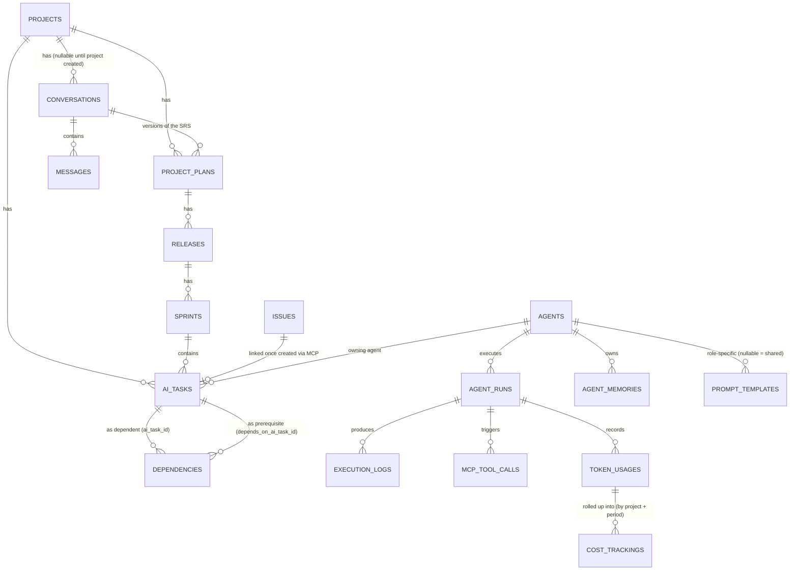

# Phase 4 — Database Design — redmineflux_agentos

**Status**: Specification only. No migrations, models, or code of any kind exists in or is implied by this document.
**Relationship to other docs**: [docs/DATABASE-SCHEMA.md](DATABASE-SCHEMA.md) (`rao-001`) already defines every table, its columns, and a plain-text entity relationship summary — this document does not repeat that, it is the **deepening** ROADMAP.md's fuller Phase 4 deliverable list asks for: a real ERD, a consolidated Indexing Strategy, Constraints, Enumerations, JSON Field Usage, State Machines, Soft Delete Strategy, Versioning Strategy, and Performance Considerations — none of which existed as their own reviewable sections before this document. This is the same relationship [docs/PHASE2-CORE-TECHNICAL-ARCHITECTURE.md](PHASE2-CORE-TECHNICAL-ARCHITECTURE.md) has to `docs/PHASE1-SPECIFICATION.md` §2.

---

## 1. Database Architecture Overview

Every table is prefixed `redmineflux_agentos_` (CLAUDE.md convention). Foreign keys to Redmine core tables (`projects`, `issues`, `users`, `versions`) reference Redmine's existing models — this plugin adds no columns to core tables and no core migrations (VISION.md Project Scope). All tables are designed to work identically across every database engine Redmine itself supports (MySQL, PostgreSQL, SQLite) — several decisions below (§4 Constraints, §7 JSON Field Usage) exist specifically to avoid relying on a feature only one of those three engines has.

Three groups, matching [docs/DATABASE-SCHEMA.md](DATABASE-SCHEMA.md)'s own structure:

1. **Core agent tables** — `agents`, `agent_runs`, `agent_memories`
2. **Conversation / planning tables** — `conversations`, `messages`, `project_plans`, `releases`, `sprints`, `ai_tasks`, `dependencies`
3. **Prompt / knowledge tables** — `prompt_templates`, `knowledge_base_entries`
4. **Governance / operations tables** — `execution_logs`, `mcp_tool_calls`, `token_usages`, `cost_trackings`, `configurations`, `audit_logs`

---

## 2. Entity Relationship Diagram (ERD)

This diagram covers the tables with meaningful relationships. `knowledge_base_entries`, `configurations`, and `audit_logs` are intentionally omitted — they relate to `projects` only via a nullable `project_id` (global-scope rows are the norm, per §7/§8) and adding them would clutter the diagram without adding relationship information not already in [docs/DATABASE-SCHEMA.md](DATABASE-SCHEMA.md).

---

## 3. Table Specifications, Column Definitions, Relationships, Foreign Keys

Already fully specified in [docs/DATABASE-SCHEMA.md](DATABASE-SCHEMA.md) — this document does not duplicate that content. Every section below assumes that document's column definitions as given.

---

## 4. Indexing Strategy

**Rule**: every foreign key gets an index; every uniqueness requirement gets a unique index; every dashboard/read-model query path (Phase 2 §B.9) gets a covering index for its actual `WHERE`/`ORDER BY` shape — indexes are not added speculatively beyond these three triggers.

[docs/DATABASE-SCHEMA.md](DATABASE-SCHEMA.md) already specifies indexes for `agent_runs`, `agent_memories`, and `dependencies`. This table completes the catalog for every other table:

| Table | Index | Purpose |
|---|---|---|
| `conversations` | `(project_id, status)` | Requirement Review screen: find the active/pending-review conversation for a project |
| `conversations` | `(user_id)` | "My conversations" listing |
| `messages` | `(conversation_id, created_at)` | Ordered message thread rendering (§6 in `WORKFLOW.md`) |
| `project_plans` | `(project_id, status)` | Find the currently-approved plan for a project without scanning versions |
| `project_plans` | `(conversation_id)` | FK |
| `releases` | `(project_plan_id, sequence)` | Release Planner screen ordering |
| `sprints` | `(release_id, status)` | Sprint Planner screen |
| `ai_tasks` | `(project_id, status)` | Dashboard read-models (Phase 2 §B.9 — denormalized status queries) |
| `ai_tasks` | `(sprint_id)` | Sprint Planner ticket listing |
| `ai_tasks` | `(agent_id)` | Agent Dashboard "current ticket" column |
| `ai_tasks` | `(issue_id)` | Linking back from a Redmine issue |
| `prompt_templates` | `(key, is_active)` | Resolution hot path (Phase 2 §A.10) — not a uniqueness constraint, see §6 for why |
| `knowledge_base_entries` | `(project_id)` | Project-scoped retrieval |
| `mcp_tool_calls` | `(agent_run_id)` | Execution History screen |
| `mcp_tool_calls` | `(status)` | Pending Approvals queue (`WHERE status = 'pending_confirmation'`) |
| `token_usages` | `(agent_run_id)` | FK |
| `token_usages` | `(project_id, created_at)` | Token Usage dashboard date-range queries |
| `cost_trackings` | `(project_id, period)` | Already implied by the unique index in `docs/DATABASE-SCHEMA.md` — restated here for completeness |
| `audit_logs` | `(target_type, target_id)` | "Show audit history for this record" lookups |
| `audit_logs` | `(user_id)`, `(agent_id)` | "Show everything this user/agent did" lookups |

---

## 5. Constraints

- **NOT NULL policy**: every column that a domain rule depends on being present is `NOT NULL` at the DB level, not just validated in Ruby — e.g. `agent_runs.status`, `ai_tasks.task_type`, `mcp_tool_calls.tool_name`. Columns that are legitimately optional per [docs/DATABASE-SCHEMA.md](DATABASE-SCHEMA.md) (e.g. `agent_runs.issue_id`, `conversations.project_id`) stay nullable — nullability is a documented design choice there, not an oversight here.
- **Foreign key constraints**: declared at the DB level (not application-only) for every FK column, so a bug can never insert an orphaned row regardless of which code path wrote it.
- **Uniqueness — cross-database portability decision**: [docs/DATABASE-SCHEMA.md](DATABASE-SCHEMA.md) states "only one active version per key" for `prompt_templates` but does not back it with a unique index — this is intentional, not a gap. A *partial* unique index (`UNIQUE ... WHERE is_active = true`) is natively supported by PostgreSQL and SQLite but not by MySQL (Redmine's most common production database) before MySQL 8.0.13's functional-index workaround, which is not portable enough to depend on. **Decision: "one active version per key" is enforced at the application layer** (a `before_save` callback that deactivates the previous active row in the same transaction as activating a new one — Phase 2 §A.2's "services own transactions" rule applies here), not by a DB constraint. This is a deliberate portability tradeoff, not an omission — see Gate 3 finding #1 in `rao-009` for the race-condition risk this tradeoff creates and its required mitigation.
- **Dependency cycle prevention**: `redmineflux_agentos_dependencies` — already specified in `docs/DATABASE-SCHEMA.md` as an application-level check at insert time (a DB-level check for graph acyclicity isn't expressible as a simple constraint in any of the three supported engines) — restated here because it's a constraint in the domain sense even though it isn't a SQL `CONSTRAINT`.

---

## 6. Enumerations

Every enum-like string column, its allowed values, and how it's enforced:

| Table.Column | Values | Enforced by |
|---|---|---|
| `agents.status` | `enabled`, `disabled` | Rails `validates :status, inclusion:` (app-level; DB-level `NOT NULL` only) |
| `agent_runs.status` | `queued`, `running`, `waiting_on_dep`, `completed`, `failed`, `dead`, `cancelled` | `WorkflowEngine::StateMachine` instance (Phase 2 §A.6) — see §8 below |
| `agent_memories.scope` | `short_term`, `long_term` | App-level validation |
| `conversations.status` | `active`, `awaiting_user`, `srs_review`, `approved`, `closed` | `WorkflowEngine::StateMachine` instance (Phase 2 §A.6) |
| `messages.role` | `user`, `agent`, `system` | App-level validation |
| `project_plans.status` | `draft`, `pending_approval`, `approved`, `superseded` | App-level validation (not a `WorkflowEngine::StateMachine` instance in v1 — simpler linear progression, no branching/retry semantics that would justify the shared engine) |
| `releases.status` | `planned`, `in_progress`, `released` | App-level validation |
| `sprints.status` | `planned`, `active`, `completed` | App-level validation |
| `ai_tasks.task_type` | `epic`, `story`, `task`, `subtask` | App-level validation |
| `ai_tasks.status` | Mirrors the linked issue's Redmine tracker status (`WORKFLOW.md` §14), **plus one AgentOS-only value: `deleted`** | App-level validation; `deleted` is set (not a physical row delete) when the linked issue is removed via `delete_issue` — see §10 Soft Delete Strategy. `deleted` is mutually exclusive with every mirrored issue-status value — an `ai_task` is never simultaneously "mirroring an issue" and "deleted" |
| `dependencies.dependency_type` | `blocks`, `relates_to` | App-level validation |
| `mcp_tool_calls.status` | `pending_confirmation`, `executed`, `rejected`, `failed` | App-level validation |

---

## 7. JSON Field Usage

Every `_json` column, why it's JSON instead of a normalized table, and the portability rule that governs it:

| Table.Column | Purpose | Why JSON, not normalized | Redaction required? |
|---|---|---|---|
| `agents.config_json` | Per-agent config (model override, tool allow-list) | Shape varies per agent role; no cross-table querying need | No |
| `agent_runs.input_json` / `output_json` | Snapshot of what an agent run received/produced | Free-form, agent-role-dependent shape; queried only by `agent_run_id`, never by inner key | No |
| `agent_memories.value_json` | Arbitrary remembered value | Same reasoning as above | Possibly — depends on content; treated as sensitive by default (§ Security Strategy, Phase 2 §B.8) |
| `project_plans.srs_json` | Structured SRS consumed by the Planning Engine | Structured but with an evolving shape (new SRS sections may be added without a migration) | No |
| `prompt_templates.variables_json` | Declared template variables | Small, fixed-shape array; JSON is simpler than a join table for this cardinality | No |
| `mcp_tool_calls.params_json` / `result_json` | Tool call inputs/outputs | Shape is per-tool; queried only by `agent_run_id`/`id`, never by inner key | **Yes — secrets redacted before persistence (CLAUDE.md rule, `docs/MCP-TOOLS.md`)** |
| `execution_logs.metadata_json` | Structured log context | Free-form by design (Phase 2 §B.5) | No |
| `configurations.value_json` | Config value (shape depends on `key`) | Config values are heterogeneous by nature | Depends on `key` — provider credentials (from v2+) are never stored here in plaintext regardless |
| `audit_logs.before_json` / `after_json` | State snapshot for an audited action | Must capture arbitrary model state at a point in time | Same redaction rule as `params_json` |

**Portability rule**: no application code queries *inside* a JSON column at the database level (e.g. no `WHERE value_json->>'key' = ...`) — JSON columns are always read whole into the application and filtered/queried there. JSON query operators differ significantly across MySQL, PostgreSQL, and SQLite, and relying on them would silently break portability the same way a partial unique index would (§5). Any future need to query by an inner JSON key is a signal that field should be promoted to a real column instead, not a signal to add DB-specific JSON query code.

---

## 8. State Machines

Two tables are governed by a `WorkflowEngine::StateMachine` instance (Phase 2 §A.6) — this section is the DB-design-level catalog; the transition/guard logic itself is fully specified in [WORKFLOW.md](../WORKFLOW.md) §8 and §14.

| Table.Column | States | Canonical definition |
|---|---|---|
| `agent_runs.status` | `queued → running → waiting_on_dep/completed/failed → dead/cancelled` | `WORKFLOW.md` §8 |
| *(ticket status, not a table column in this schema — Redmine's own `issues.status_id`, denormalized onto `ai_tasks.status`)* | `Backlog → Ready → InProgress → CodeReview → Testing → Completed → Released` | `WORKFLOW.md` §14 |

`conversations.status` (§6) is a simpler linear/branching progression handled by application validation, not the shared state-machine engine — see the Enumerations table's note on why it doesn't need the heavier mechanism (no retry/backoff semantics to configure).

---

## 9. Audit Tables

`redmineflux_agentos_audit_logs` is already specified as immutable in [docs/DATABASE-SCHEMA.md](DATABASE-SCHEMA.md) ("no update/delete path exposed in the app layer"). This section strengthens that from a policy statement into a defense-in-depth requirement for whichever future task implements the model:

1. **No `update`/`destroy` route** — the future `AuditLogsController` (or equivalent) exposes only `index`/`show` actions, by omission (Gate 1 checklist: every action maps to exactly one permission — there is no permission that maps to editing an audit log, because no such action exists).
2. **Model-level guard, not just controller-level omission** — the model itself raises on `update`/`destroy` (e.g. overriding `readonly?` to return `true` after creation, or a `before_update`/`before_destroy` callback that raises) — this is the defense-in-depth layer that protects against a console session or a future rake task accidentally mutating history, not just a missing UI route.
3. **`execution_logs` and `mcp_tool_calls` are not immutable in the same sense** — `mcp_tool_calls` rows are explicitly *updated* (status moves `pending_confirmation → executed`, per `docs/MCP-TOOLS.md`) — only `audit_logs` carries the immutability requirement. This distinction is worth stating explicitly so a future implementer doesn't over-apply the read-only guard to a table that needs normal updates.

---

## 10. Soft Delete Strategy

**Decision: no table in this schema uses a `deleted_at` soft-delete column.** Rationale:

- The audit requirement soft deletes are usually reached for is already satisfied by `audit_logs`/`execution_logs`/`mcp_tool_calls` (append-only, immutable per §9) — preserving soft-deleted rows in *operational* tables would duplicate that guarantee for no benefit.
- Redmine core itself does not use soft deletes for `Issue`/`Project` — following the host's own convention keeps AgentOS's tables consistent with what a Redmine-experienced engineer already expects.
- A `deleted_at` column is an easy-to-forget footgun: every query everywhere must remember `WHERE deleted_at IS NULL` or silently include "deleted" rows — a well-known Rails anti-pattern risk with no concrete v1 requirement driving the need for it.
- Where "don't lose this data" genuinely matters (`agent_runs`, `execution_logs`), the correct control is a **retention/archival policy** (§12), not a soft-delete flag on every row forever.

**The one real case needing a decision — a linked Redmine issue is deleted**: `delete_issue` (`docs/MCP-TOOLS.md`, `requires_confirmation: true`) can remove the Redmine `Issue` an `ai_tasks` row's `issue_id` points to. Rather than adding a soft-delete column to `ai_tasks`, **the existing `status` column gets one additional value: `deleted`** (§6 Enumerations) — the `ai_tasks` row itself is retained (so ticket-generation statistics and dependency-graph history aren't silently lost) but is unambiguously marked as no longer corresponding to a live issue.

**Referential integrity with Redmine core**: Redmine's `Project`/`Issue` models are not edited by this plugin (no core patches), but Rails plugins may extend a core model's *associations* at boot via a `to_prepare` block — this is standard, widely-used Redmine plugin practice (adding `has_many` declarations to `Project`/`Issue` from the plugin side), not a source-file edit, and is not prohibited by the "no core patches" rule (which is about not modifying Redmine's own files). **Decision**: at plugin boot, `Project` gains `has_many :redmineflux_agentos_ai_tasks, dependent: :destroy` (and similarly for `conversations`, `project_plans`) so that if a project is destroyed through Redmine's own native admin UI (a path entirely outside AgentOS's own MCP tools — there is no `delete_project` tool, per `docs/MCP-TOOLS.md`), AgentOS's plugin-owned rows for that project are cleaned up rather than left orphaned. The direction is one-way and load-bearing: the association is declared on `Project`/`Issue` (the "one" side) pointing at AgentOS's own tables (the "many" side) — destroying a `Project` never has any effect that reaches back and destroys a *different* Redmine record, only AgentOS's own rows for that project.

---

## 11. Versioning Strategy

One consolidated pattern, applied consistently to the two tables that need version history (`prompt_templates`, `project_plans`): **a new row per version, a monotonically increasing integer `version` column, the previous version marked `superseded`/`is_active: false` in the same transaction that activates the new one, and no version is ever mutated in place once superseded.** This is what makes an in-flight `agent_run` (Phase 2 §A.10) or an already-rendered SRS review screen immune to a concurrent edit — they already hold a reference to an immutable, specific version.

**What does *not* get this treatment**: `agents.config_json` is mutated in place — it's live configuration (enable/disable, tool allow-list), not an artifact whose history has product value the way a prompt's wording or an SRS's content does. The rule for choosing: if a past version could ever need to be shown, diffed, or referenced by an already-in-flight process (prompts, SRS), it's versioned; if it's simply "the current setting" with no such requirement (agent config, most of `configurations`), it's mutated in place.

---

## 12. Performance Considerations

- **Unbounded growth**: `execution_logs`, `mcp_tool_calls`, and `token_usages` grow with every agent run and never shrink on their own — this is the DB-specific counterpart to Phase 2 §B.10's Scalability Strategy. **Decision**: a configurable retention window (default: `execution_logs` at `debug` level retained 90 days, `info`/`warn`/`error` retained indefinitely; `token_usages`/`cost_trackings` retained indefinitely since they're the basis for historical cost reporting; `mcp_tool_calls` retained indefinitely since they're the audit trail for Redmine state changes) enforced by a scheduled background job (Phase 2 §B.1 `CostRollupJob`-style job, a new `LogRetentionJob`), never a blocking operation in a request or agent run.
- **Retention must never touch an in-flight run**: the retention job's window must exclude any `agent_run` not yet in a terminal state (`completed`/`failed`/`dead`/`cancelled`, `WORKFLOW.md` §8) even if its `created_at` is old — a long-`waiting_on_dep` run's logs must survive until the run itself finishes, not be pruned out from under it (see Gate 3 finding #3 in `rao-009`).
- **Dashboard queries never join through `agent_runs` live** — already established in Phase 2 §B.9; this document's indexes (§4) are what make that guarantee actually fast rather than just architecturally intended.
- **No new indexing decisions beyond §4** — this section is about growth/retention, not query-path indexing, which is fully covered above.
