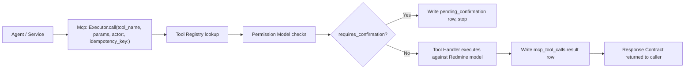
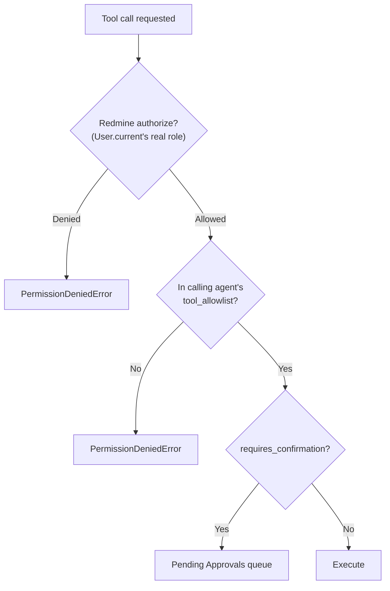

# Phase 7 — MCP Architecture (Deepened) — redmineflux_agentos

**Status**: Specification only. No tool handler code exists yet — Phase 13 implements it.
**Relationship to other docs**: [docs/MCP-TOOLS.md](MCP-TOOLS.md) (`rao-001`) already catalogs every tool, its confirmation flag, and the permission model in prose — this document formalizes the **Tool Registry design**, **Request/Response Contracts**, and **Error Handling** that ROADMAP.md's Phase 7 asks for and weren't yet their own reviewable sections. [docs/PHASE2-CORE-TECHNICAL-ARCHITECTURE.md](PHASE2-CORE-TECHNICAL-ARCHITECTURE.md) §A.4/§B.8 already named `Mcp::ToolRegistry`/`Mcp::Executor` and the security enforcement mapping — this document is their full design.

---

## 1. MCP Architecture Overview

One call path, no exceptions, exactly as [WORKFLOW.md](../WORKFLOW.md) §10 describes operationally — this section is the component design behind it:

`Mcp::Executor` is the **only** write path — no agent, service, or controller calls a Redmine model directly for anything this plugin manages (AD-3, `docs/PHASE1-SPECIFICATION.md`).

---

## 2. Tool Registry Design

`Mcp::ToolRegistry` is a lookup table, populated at boot (via `to_prepare`, `docs/PHASE5-FOLDER-STRUCTURE.md` §9), mapping each tool name to its declaration:

| Field | Purpose |
|---|---|
| `tool_name` | e.g. `redmineflux_agentos_create_issue` |
| `category` | One of the 11 categories in [docs/MCP-TOOLS.md](MCP-TOOLS.md) |
| `handler` | The class/method that executes it (`lib/redmineflux_agentos/mcp/tools/*.rb`, `docs/PHASE5-FOLDER-STRUCTURE.md` §6) |
| `params_schema` | Declared required/optional params and their types — §4 |
| `requires_confirmation` | Boolean, per [docs/MCP-TOOLS.md](MCP-TOOLS.md) |
| `read_only` | Boolean — drives the audit-log-exemption rule already stated in `docs/MCP-TOOLS.md` |

**Extension point**: adding a new tool is a new registry entry plus a new handler — never a change to `Mcp::Executor` itself (Open/Closed, Phase 2 §A.3), the same pattern already used for `AgentEngine::Registry` and `Provider::Registry`.

---

## 3. Permission Model

Three independent layers, checked in this order, matching Phase 2 §B.8's enforcement mapping — this section is the decision-flow behind that table:

Layer 1 (Redmine's own authorization) and Layer 2 (agent tool allow-list) are both **denial-capable independently** — an agent with a tool in its allow-list still cannot act outside what the acting `User.current` is actually permitted to do in Redmine, and a user with full Redmine permissions still cannot make an agent call a tool outside that agent's declared allow-list. Neither layer is a superset of the other.

---

## 4. Request/Response Contracts

Every tool handler, regardless of category, is called and returns through the same shape — this is what makes `Mcp::Executor` a single, uniform write path rather than 20 special cases:

**Request** (built by `Mcp::Executor` from the caller's arguments):

| Field | Type | Notes |
|---|---|---|
| `tool_name` | string | Registry lookup key |
| `params` | hash | Validated against `params_schema` (§2) before the handler ever runs — a missing required param is rejected at this layer, the handler never sees a malformed request |
| `actor` | `User` | Required, never defaulted — Phase 2 §B.8 |
| `idempotency_key` | string | Per-call, index-suffixed when part of a multi-call turn (`docs/PHASE3-MOCK-AI-PROVIDER-FOUNDATION.md` §2.1) |

**Response** (returned by the handler, wrapped by `Mcp::Executor`):

| Field | Type | Notes |
|---|---|---|
| `status` | enum | `executed` \| `pending_confirmation` \| `rejected` \| `failed` — mirrors `mcp_tool_calls.status` exactly ([docs/DATABASE-SCHEMA.md](DATABASE-SCHEMA.md)) |
| `result` | hash, nullable | The created/updated record's key attributes (e.g. `{id:, subject:}` for `create_issue`) — never the full Redmine model serialized, to avoid accidentally leaking fields that weren't meant to be read back |
| `error` | hash, nullable | Present only when `status: failed` or `rejected` — `{error_code, message, retryable}`, the same shape as Phase 3 §2.3's Provider Error Model, reused here deliberately so callers handling errors don't need two different error shapes depending on whether the failure came from the Provider or from MCP |

---

## 5. Error Handling

Extends Phase 2 §B.7's `McpToolError` hierarchy with the specific conditions a tool call can fail for:

| Condition | Error | `retryable` |
|---|---|---|
| Params fail `params_schema` validation | `McpToolError::InvalidParamsError` | `false` — retrying with the same bad params cannot succeed |
| Redmine-side validation failure (e.g. `Issue.create` fails `ActiveRecord::RecordInvalid`) | `McpToolError::RedmineValidationError` | `false` — the underlying data is invalid, not a transient condition |
| Permission Model layer 1 or 2 denies | `McpToolError::PermissionDeniedError` (Phase 2 §B.7) | `false` |
| Tool requires confirmation and is rejected by a human | Not an error — `mcp_tool_calls.status: rejected` is a normal terminal outcome, not an exception | n/a |
| Underlying Redmine call raises an unexpected exception (DB timeout, etc.) | `McpToolError::UnexpectedError` (wraps the original) | `true` — matches the agent-run-level retry policy (Phase 2 §B.4) |

**Never silently swallowed**: every one of these is written to `mcp_tool_calls` with its `error` payload (§4) before being raised/returned, so the Execution History screen can show *why* a call failed without needing to reconstruct it from application logs.

---

## 6. Tool Categories

Unchanged from [docs/MCP-TOOLS.md](MCP-TOOLS.md) — Project & Planning, Issues, Wiki, Files, Time & Workload, Reporting (the document's actual grouping; ROADMAP.md's phase list names a slightly finer split — Project Management, Issue Management, Release Management, Sprint Management, Wiki Management, File Management, Time Tracking, Workload, Reporting, Search, Notifications — which maps onto `docs/MCP-TOOLS.md`'s groups as: Release/Sprint Management fold into Project & Planning, since sprints are plugin-owned rather than a distinct MCP category (AD-1); Search and Notifications are read-only/passive concerns already covered under Issues' `search_issues`/`read_*` tools and the Notification Center module respectively, not separate tool categories). No new tool category is introduced by this document.
