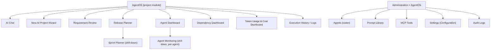
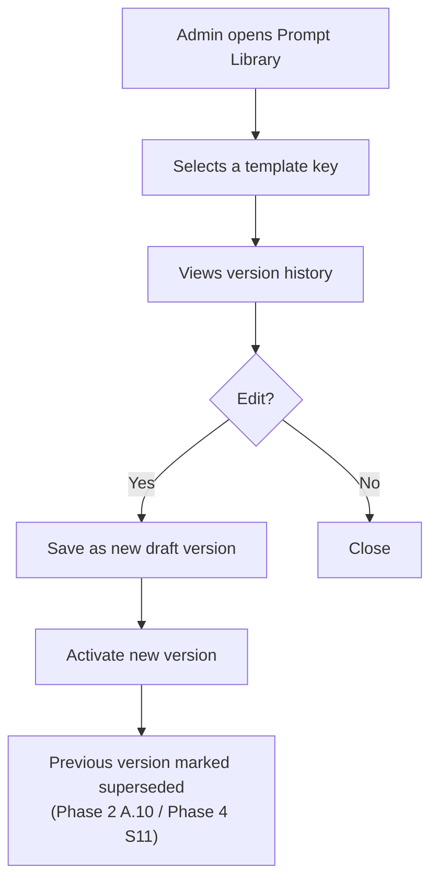
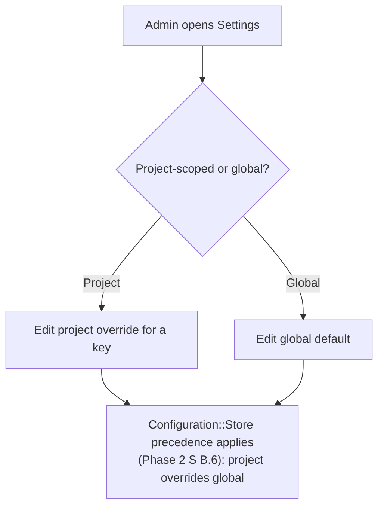

# Phase 9 — UI/UX Specification (Deepened) — redmineflux_agentos

**Status**: Specification only. No views/controllers exist yet — Phase 15 implements them.
**Relationship to other docs**: [docs/UI-WIREFRAMES.md](UI-WIREFRAMES.md) (`rao-001`) wireframed 7 combined screens. ROADMAP.md's Phase 9 list asks for Information Architecture, Navigation Structure, User Flows, and 13 named pages — two of which (**Prompt Library**, **Settings**) had no wireframe at all, and two more (**Sprint Planner**, **Agent Monitoring**) were implicitly folded into other screens without being distinct pages. This document adds the missing structure and the two missing wireframes; it does not re-draw the 7 screens that already exist.

---

## 1. Information Architecture



This matches [docs/PHASE1-SPECIFICATION.md](PHASE1-SPECIFICATION.md) §4's two menu trees exactly — the diagram adds the two new drill-down relationships (Sprint Planner under Release Planner; Agent Monitoring under Agent Dashboard) that make Sprint Planner and Agent Monitoring distinct pages without being separate top-level menu items.

---

## 2. Navigation Structure

Unchanged from [docs/PHASE1-SPECIFICATION.md](PHASE1-SPECIFICATION.md) §4 (project-level menu, admin menu, permission gates per item). **Addition**: breadcrumb convention for the two new drill-down pages — `AgentOS › Release Planner › Sprint 2` and `AgentOS › Agent Dashboard › Database Agent` — so a user always has a one-click path back to the parent list view, consistent with how `docs/UI-WIREFRAMES.md`'s existing screens all show an `AgentOS › {Screen}` breadcrumb.

---

## 3. User Flows

The happy-path and alternative flows are already fully specified in [WORKFLOW.md](../WORKFLOW.md) §4 — this section adds the two flows that involve the newly-specified pages:





---

## 4. Wireframes

The 7 existing wireframes in [docs/UI-WIREFRAMES.md](UI-WIREFRAMES.md) are unchanged. Two new ones, matching that document's ASCII style:

### 4.1 Prompt Library (admin)

```
┌─────────────────────────────────────────────────────────────────┐
│ Administration › AgentOS › Prompt Library                        │
├─────────────────────────────────────────────────────────────────┤
│ Category        Key                              Active Version  │
│ ───────────────────────────────────────────────────────────────  │
│ Requirement...  requirement_analysis.parse_idea   v3   [Edit]    │
│ Clarification.. clarification_questions.generate  v1   [Edit]    │
│ SRS Generation  srs_generation.build               v2   [Edit]    │
│ ...                                                                │
├─────────────────────────────────────────────────────────────────┤
│ Selected: requirement_analysis.parse_idea                        │
│  v1 (superseded)  v2 (superseded)  v3 (active) ● [View diff]     │
│                                                                     │
│  [ Edit as new draft ]              [ Activate a prior version ] │
└─────────────────────────────────────────────────────────────────┘
```

### 4.2 Settings / Configuration (admin)

```
┌─────────────────────────────────────────────────────────────────┐
│ Administration › AgentOS › Settings          Scope: [ Global ▾ ] │
├─────────────────────────────────────────────────────────────────┤
│ Key                        Value                        Updated  │
│ ───────────────────────────────────────────────────────────────  │
│ active_provider             mock                          —      │
│ fixture_directory            config/agentos/fixtures/mock  —      │
│ logging_level                 debug                        —      │
│ simulation_mode                deterministic                 —      │
│ cost_rules                    mock-standard                  —      │
│                                                                     │
│ [ Switch to project scope to see per-project overrides ]         │
└─────────────────────────────────────────────────────────────────┘
```

**No credential fields are ever rendered here in v1** — the Mock Provider has no credentials (Phase 3 §2.7); this screen's design must not assume a "credentials" row exists until a real provider (v2+) is configured, and even then, per CLAUDE.md's rule, a credential value is never echoed back to the UI once saved — only a masked indicator (`•••• configured`) and a "replace" action.

---

## 5. Page Specifications — clarifying Sprint Planner and Agent Monitoring

- **Sprint Planner** is not a new top-level route — it's `Release Planner`'s drill-down for one sprint, showing that sprint's ticket board and burndown. It exists as a distinct *page* (own URL, own breadcrumb) without being a distinct *menu item*, resolving the ambiguity between ROADMAP.md listing it separately and `docs/UI-WIREFRAMES.md` showing sprints only inline within Release Planner.
- **Agent Monitoring** is `Agent Dashboard`'s drill-down for one agent — full run history (`agent_runs` for that agent), its current memory contents (`agent_memories`, redacted per Phase 2 §B.8 where applicable), and its recent MCP tool calls. `Agent Dashboard` itself (already wireframed) stays the summary table across *all* agents; this page is the per-agent detail view that summary table's rows link into.

Every other page in ROADMAP.md's Phase 9 list (Agent Dashboard, AI Chat, New AI Project Wizard, Requirement Review, Release Planner, Execution History, Logs, Token Usage, Cost Dashboard) already has a specification — `docs/UI-WIREFRAMES.md`'s wireframes *are* the page specification for those, at the depth Phase 1 established; this document does not re-specify them at a different depth than the rest of the plugin's screens.

---

## 6. Dashboard Designs

| Dashboard | Widgets | Data source |
|---|---|---|
| Agent Dashboard | Status table, Pending Approvals panel | `agent_runs` (denormalized status), `mcp_tool_calls` (`status: pending_confirmation`) |
| Dependency Dashboard | Dependency graph visualization | `dependencies` + `ai_tasks.status` |
| Release Planner | Sprint progress bars, ticket counts | `releases`, `sprints`, `ai_tasks` |
| Sprint Planner *(new, §4.1 drill-down)* | Ticket board, burndown | `ai_tasks` scoped to one `sprint_id` |
| Agent Monitoring *(new drill-down)* | Run history table, memory viewer, recent tool calls | `agent_runs`, `agent_memories`, `mcp_tool_calls` scoped to one `agent_id` |
| Token Usage & Cost Dashboard | Usage-by-agent bars, usage-by-day sparkline, budget alert | `token_usages`, `cost_trackings` |
| Execution History / Logs | Filterable event feed | `execution_logs`, `mcp_tool_calls`, `agent_runs` (reconstructed per `WORKFLOW.md` §15's replay note) |

Every dashboard reads from a denormalized read-model, never a live join through `agent_runs` at request time — already the standing rule (Phase 2 §B.9); this table exists to make each dashboard's actual data source explicit and auditable against that rule.
